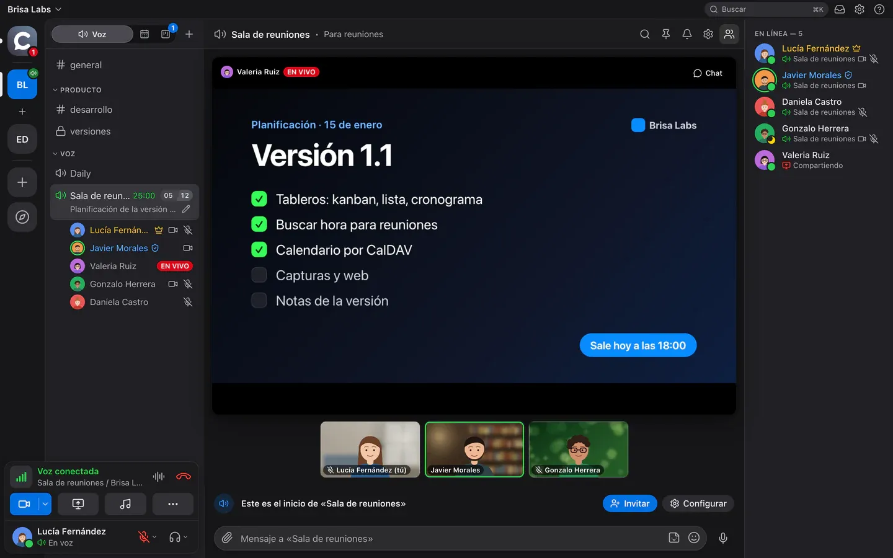
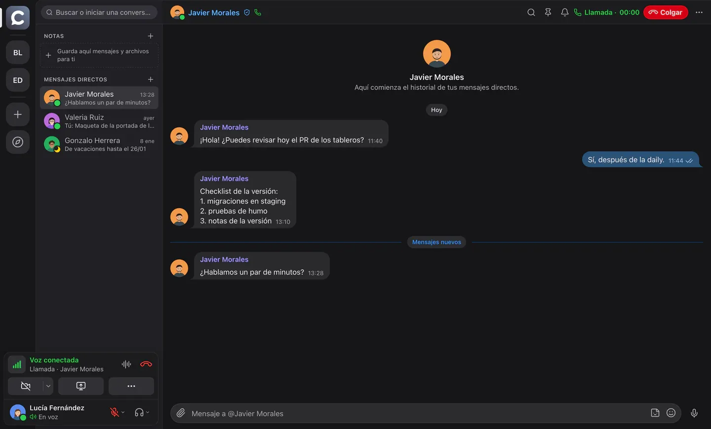
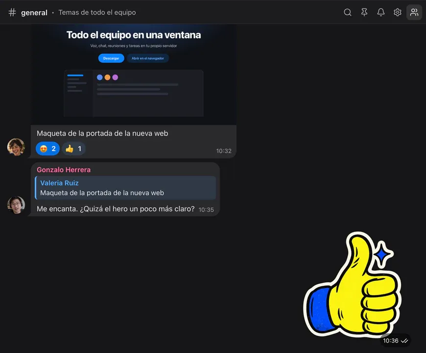
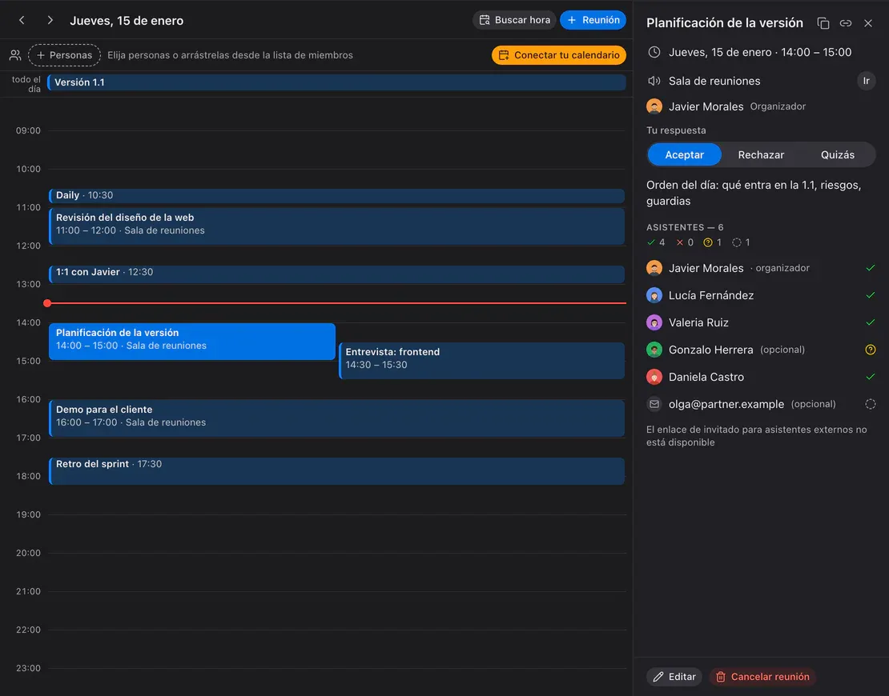
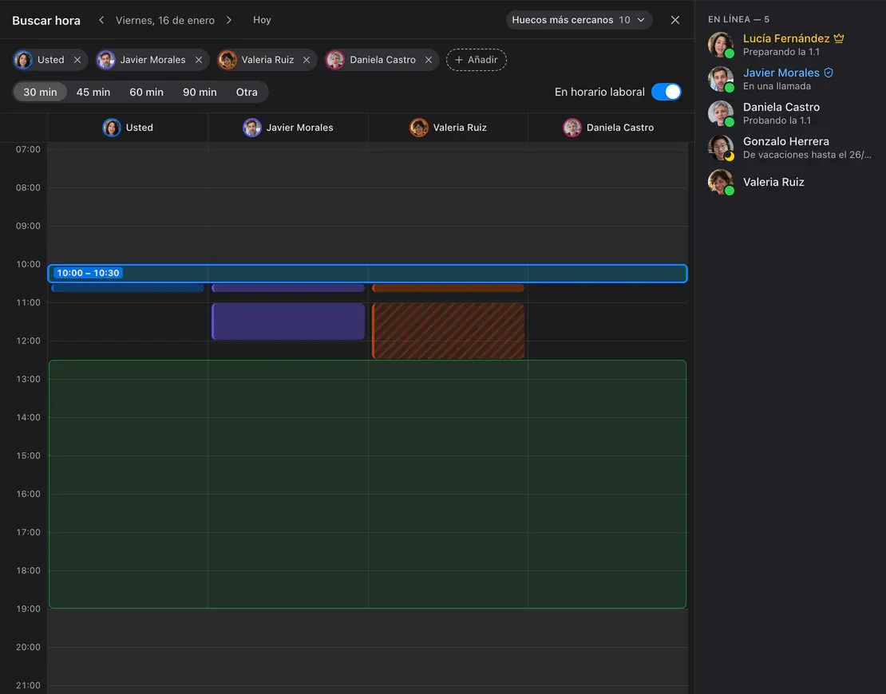
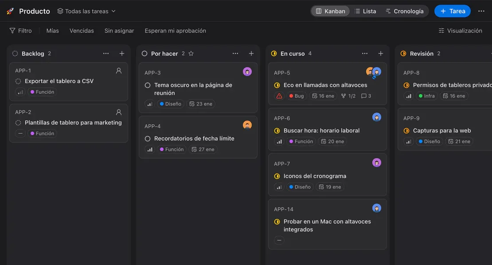
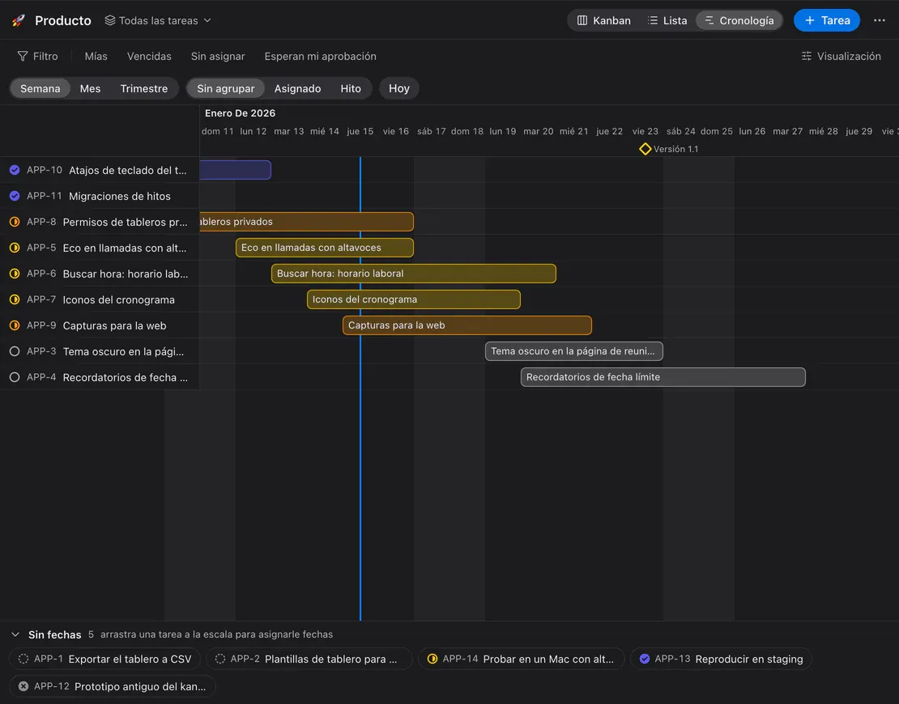
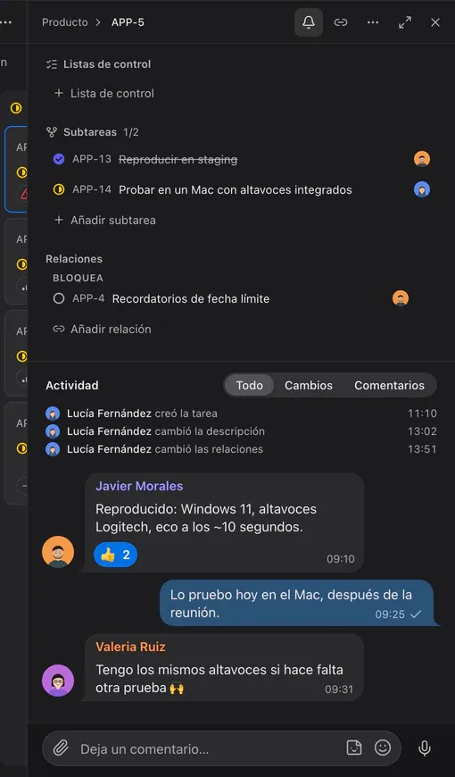
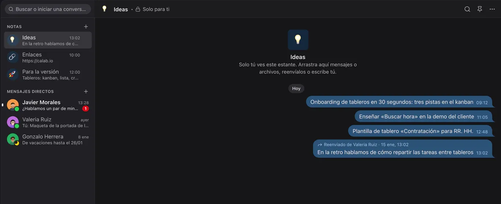
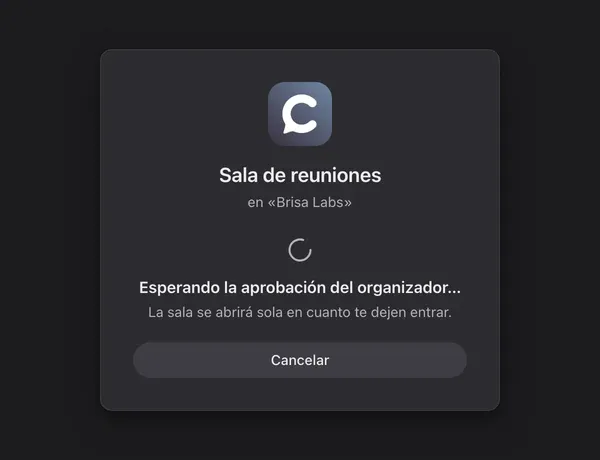

<p align="center"><a href="README.md">English</a> · <a href="README.ru.md">Русский</a> · <b>Español</b> · <a href="README.zh-CN.md">简体中文</a></p>

<p align="center">
  
</p>

<h1 align="center">Calab</h1>

<p align="center">
  Todo el equipo en una ventana: salas de voz, chat, reuniones y tareas en tu propio servidor.<br>
  <sub>Mensajería de equipo autoalojada con la voz primero. macOS · Windows · Linux · web.</sub>
</p>

<p align="center">
  <a href="LICENSE"></a>
  <a href="https://github.com/itrcz/calab/actions/workflows/ci.yml"></a>
  
  
  
  <a href="https://calab.io/es/"></a>
</p>

<p align="center">
  
</p>

---

## Qué es

Calab es una mensajería para equipos donde lo primero es la **voz**. Entras en una sala y oyes a tus compañeros al momento; al lado tienes un chat como Telegram, un calendario con reuniones y tableros de tareas al estilo de Linear. Todo funciona en tu propio servidor: un `docker compose`, con PostgreSQL y LiveKit dentro, sin servicios externos ni suscripciones.

Está pensado para equipos de hasta 20–30 personas en voz a la vez y hasta 3 pantallas compartidas por sala. El cliente es ligero: 0,05 % de CPU sin llamada y ≈ 7 % en voz en un MacBook Air M4.

## Funciones

### 🎙 Voz y vídeo



- **Salas de voz**: un clic para entrar; quién habla se ve en la lista de salas; estado de la sala, temporizador y límite de participantes.
- **Sonido limpio**: cancelación de eco AEC3 y supresión de ruido RNNoise (sin servicios externos), Opus con DTX; activación por voz o **pulsar para hablar** con cualquier tecla, también en segundo plano.
- **Modo músico**: interruptor personal que desactiva la cancelación de eco, la supresión de ruido y la ganancia automática y pasa Opus a un perfil musical (128 kbps mono / 192 kbps estéreo, FEC, sin DTX): toca un instrumento o canta en directo sin que el procesado se coma el sonido. Requiere auriculares; los demás ven un icono de guitarra junto a tu nombre. Plan Team y superiores.
- **Pantalla compartida** en AV1 o H.264 por hardware con simulcast: cada espectador recibe la calidad que permite su conexión; los espectadores señalan y dibujan encima.
- **Cámara** con fondo desenfocado o una imagen (fondos integrados y del espacio).
- **Llamadas uno a uno** en mensajes directos, con tono de llamada, cámara y pantalla compartida.
- **Grabaciones de reuniones**: graba el servidor y transcribe GPTunneL; al chat de la sala llega una tarjeta con el resumen, el audio y la transcripción completa.
- **Botonera de sonidos**, moderación (silenciar desde el servidor, desconectar, mover arrastrando), estados.
- **Llamadas telefónicas (SIP)** — conecta tu propio proveedor SIP y marca un número fijo o móvil desde una sala de voz; el interlocutor entra como participante y todos ven «Marcando → Llamando → En la llamada». Ajustes del proveedor, registro de llamadas y el permiso «Hacer llamadas», que por defecto no tiene nadie ([ADR-0046](docs/adr/0046-sip-telephony.md)).
- **Salas temporales** — una sala por una hora o un día con enlace de invitado listo y, si quieres, una reunión en el calendario: un sustituto de Zoom que desaparece solo ([ADR-0044](docs/adr/0044-temp-rooms.md)).

### 💬 Chat



- Burbujas como en Telegram: respuestas, **reacciones**, reenvío a varios chats, stickers, mensajes de voz, archivos con vista previa, mensajes fijados, marcas de lectura.
- **Menciones**, notificaciones por sala, búsqueda en el espacio con morfología, cambio rápido con `⌘K`.
- **Mensajes directos** con archivo; la versión web se adapta al móvil y se instala en la pantalla de inicio.

### 📅 Calendario y reuniones

<table>
  <tr>
    <td width="50%"></td>
    <td width="50%"></td>
  </tr>
</table>

- Un día con reuniones en paralelo, la tarjeta de la reunión con asistentes y respuestas, la sala con el botón «Ir», repeticiones y recordatorios.
- **Invitaciones por correo** con `invite.ics`: la reunión llega al calendario de Apple, Google, Outlook o Yandex; los asistentes externos responden por enlace y entran como invitados.
- **Buscar hora**: columnas de ocupación de tus compañeros, huecos libres comunes y las franjas más cercanas dentro del horario laboral de todos.
- **CalDAV**: conecta Yandex, iCloud, Fastmail o Nextcloud; tu ocupación cuenta y las reuniones de Calab aparecen allí solas.

### ✅ Tableros de tareas



<table>
  <tr>
    <td width="68%"></td>
    <td width="32%"></td>
  </tr>
</table>

- **Kanban, lista y cronograma** (Gantt con hitos y la línea de «hoy»), al estilo de Linear y con sus atajos de teclado.
- Estados, prioridades, etiquetas, hitos y fechas límite; varios responsables con uno principal, subtareas y relaciones.
- Comentarios como en el chat (reacciones, stickers, mensajes de voz) junto al historial de cambios.
- Filtros, vistas guardadas, acciones en bloque; **una tarea desde cualquier mensaje**; el enlace a una tarea se despliega como tarjeta en el chat.

- **Aprobaciones** — asigna aprobadores y cuántas aprobaciones hacen falta (todas o N de M); una tarea no avanza en el tablero hasta que se aprueba ([ADR-0049](docs/adr/0049-task-approvals.md)).
### 📝 Notas



Hasta 20 estantes privados con tus nombres y emoji, como «Mensajes guardados» de Telegram, pero varios. Arrastra mensajes y archivos a un estante, reenvíalos, fíjalos y búscalos.

### 🚪 Invitados y aprobación



Un enlace de invitado lleva directo a una sala, sin registro. Con la aprobación activada (por sala o por enlace), el invitado espera en esta pantalla hasta que el organizador pulsa «Dejar entrar».

### 🧩 Aplicaciones web

Un administrador fija accesos a sitios (Grafana, la wiki, el CRM) bajo el icono del espacio en la barra izquierda. Un clic abre el sitio a pantalla completa dentro de Calab y la llamada continúa; los inicios de sesión se guardan por separado para cada aplicación, y la cámara y el micrófono solo con tu permiso ([ADR-0050](docs/adr/0050-workspace-apps.md)).

### 🤖 Bots y SDK

Un bot es un miembro con token: la misma API REST y el mismo gateway que la aplicación, permisos por roles. Lee y escribe en el chat, responde a `/comandos`, habla en las salas de voz (LiveKit, Node / Python / Go) y trabaja con los tableros según sus permisos; los eventos llegan por WebSocket o por un webhook firmado con HMAC. Bot API v2 añade el calendario (reuniones, libre/ocupado, búsqueda de hora), perfiles de miembros, invitaciones, insignias, admisión de invitados y grabación de reuniones, además de botones bajo los mensajes ([ADR-0051](docs/adr/0051-bot-api-v2.md)).

```ts
import { Bot } from '@calaba/bot-sdk';

const bot = new Bot(process.env.BOT_TOKEN, { server: 'https://app.calab.io' });
bot.on('message', (m) => bot.reply(m, m.content));
await bot.start();
```

SDK: [`packages/bot-sdk`](packages/bot-sdk); ejemplos: [`examples/bots`](examples/bots) (echo, eco de voz, TTS, Python); documentación: [docs/19-bot-api.en.md](docs/19-bot-api.en.md) (en inglés) · [ruso](docs/19-bot-api.md).

### 🔒 Servidor propio y seguridad

- **Funciona en cualquier red**: UDP → ICE/TCP → TURN/UDP 443 → TURN/TLS 443 automáticamente; una sola IP pública; probado detrás de VPN.
- Medios con DTLS-SRTP; API por HTTPS/WSS, HSTS, CSP estricta, cookies `HttpOnly/SameSite=Strict` en la web, argon2id, rotación de tokens de actualización con detección de reutilización, límites de frecuencia. Aún no hay cifrado de extremo a extremo: los medios pasan por tu propio servidor de medios.
- Todos los permisos (salas, tableros, calendario) los comprueba el servidor; el permiso de LiveKit los replica.
- **Roles por función** — permisos separados para tableros, miembros, bots, integraciones, registros, eventos y grabaciones; salas y tableros privados y cerrados que ni los administradores ven ([ADR-0048](docs/adr/0048-roles-v2.md)).
- **Docker Compose** con contenedores endurecidos, certificados de Let’s Encrypt automáticos, copias de seguridad diarias con restauración verificada, métricas de Prometheus; PostgreSQL 17 o 18.

## Próximamente

Planificado, aún no disponible:

- **Asistente de voz con IA** — un asistente de voz con IA en las salas (en pruebas).
- **IVR** — menú de voz y números internos para las llamadas telefónicas (SIP).
- **Wiki** — base de conocimiento del equipo.
- **Disco** — almacenamiento compartido de archivos del espacio.

## Inicio rápido

### Tu propio servidor

Necesitas un host Linux con IP pública, Docker + Compose y un dominio con registros A para `app`, `rtc`, `turn` (y `@` para la web).

```bash
git clone https://github.com/itrcz/calab.git && cd calab
cp infra/docker/.env.example infra/docker/.env   # DOMAIN y secretos: mira los comentarios
infra/docker/deploy.sh                            # Caddy, LiveKit, API, Postgres, Valkey
```

Puertos: `80/443` TCP, `443/UDP`, `7881/TCP`, `7882/UDP`. El primer usuario registrado es el propietario del servidor; los demás entran por invitación. Guía completa, copias de seguridad y endurecimiento: [docs/06-deployment.md](docs/06-deployment.md) (en ruso).

### La aplicación

Las versiones para macOS, Windows y Linux están en [calab.io](https://calab.io/es/#download) y en tu servidor en `https://app.<dominio>/download/`; la versión web, en `https://app.<dominio>`. Novedades de cada versión: [CHANGELOG.md](CHANGELOG.md) (en ruso; el mismo texto va a [GitHub Releases](https://github.com/itrcz/calab/releases)).

### Desarrollo

```bash
corepack enable && pnpm install && make gen       # protobuf → Go + TS
pnpm infra:dev                                    # Postgres, Valkey, LiveKit --dev
cd apps/server && go run ./cmd/server serve       # API en :3000
pnpm -F @calaba/desktop dev                       # Electron
```

Comprobaciones: `make test` (Go + TS), `make test-integration`, pruebas visuales por pantalla (`pnpm -F @calaba/desktop e2e:visual -g "<pantalla>"`). Arquitectura (en ruso): [visión general](docs/01-architecture.md) · [medios](docs/02-media.md) · [red](docs/03-network.md) · [modelo de datos y permisos](docs/04-data-model.md) · [protocolo en tiempo real](docs/05-realtime-protocol.md) · [sistema de diseño](docs/08-design.md) · [ADR](docs/adr/).

## Planes

| | Free | Team | Business | Enterprise |
|---|---|---|---|---|
| Sala de voz | hasta 5 personas | hasta 15 personas | hasta 50 personas | sin límite |
| Miembros del espacio | hasta 50 | hasta 100 | hasta 500 | sin límite |
| Calidad de audio | hasta «Normal» | cualquiera, hasta «Excelente» | cualquiera | cualquiera |
| Pantalla compartida y cámara | hasta 720p / 15 fps | sin límites de calidad | sin límites de calidad | sin límites de calidad |
| Pantallas compartidas a la vez | 1 | 2 | 5 | sin límite |
| Cámaras a la vez | 3 | 10 | 25 | sin límite |
| Archivos | 5 GB por espacio | 300 GB por espacio | 1 TB por espacio | sin límite |
| Bots | 1 | 5 | 20 | sin límite |
| Paquetes de stickers | 1 | sin límite | sin límite | sin límite |
| Tableros de tareas | 3 | 30 | 50 | sin límite |
| Calendario | ✓ | ✓ | ✓ | ✓ |
| CalDAV | — | ✓ | ✓ | ✓ |
| On-prem (servidor propio) | — | — | — | ✓ |
| Soporte | — | soporte | prioritario | ✓ |
| Precio | gratis | a consultar (**it@gptunnel.ai**) | a consultar (**it@gptunnel.ai**) | gratis para uso no comercial (BSL 1.1, «Powered by GPTunneL»); licencia comercial a consultar |

Free, Team y Business son planes en la nube de un espacio ([ADR-0024](docs/adr/0024-plans-and-limits.md)); Enterprise es Calab en tu propio servidor (on-prem), sin límites. Detalles: [calab.io/es/#pricing](https://calab.io/es/#pricing) y [COMMERCIAL-LICENSE.md](COMMERCIAL-LICENSE.md).

## Licencia

**Business Source License 1.1**: [LICENSE](LICENSE).

- El uso no comercial (personal, ONG, educación, evaluación de hasta 30 días) es **gratuito**, con «Powered by GPTunneL» en la interfaz y conservando el [NOTICE](NOTICE).
- El uso comercial requiere una licencia de GPTunneL: [COMMERCIAL-LICENSE.md](COMMERCIAL-LICENSE.md), **it@gptunnel.ai**.
- Cada versión pasa a Apache-2.0 cuatro años después de su publicación.

Los nombres y logotipos de Calab y GPTunneL son marcas registradas, consulta [TRADEMARKS.md](TRADEMARKS.md).

## Contribuir y seguridad

Se aceptan pull requests con CLA: [CONTRIBUTING.md](CONTRIBUTING.md). Informa de vulnerabilidades en privado a **it@gptunnel.ai**, consulta [SECURITY.md](SECURITY.md).

<p align="center"><sub>© 2026 GPTunneL · Powered by <a href="https://gptunnel.ai">GPTunneL</a></sub></p>
