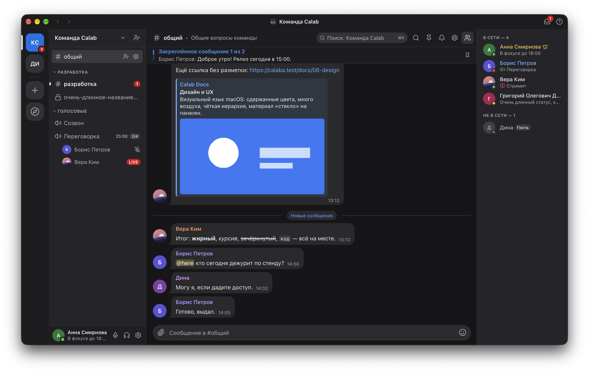
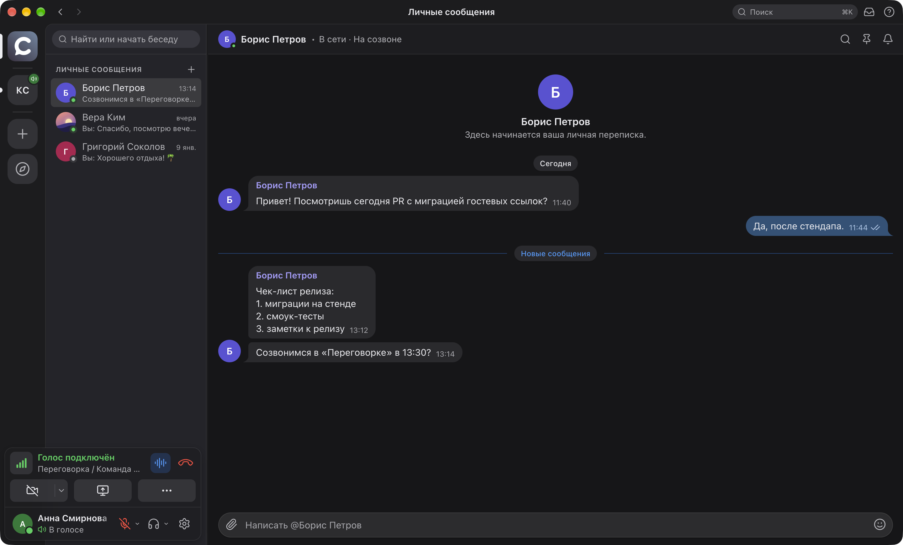
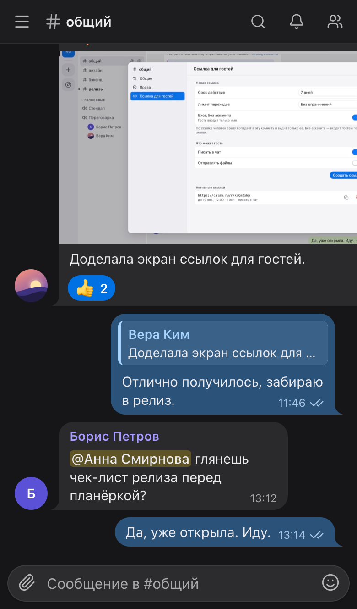
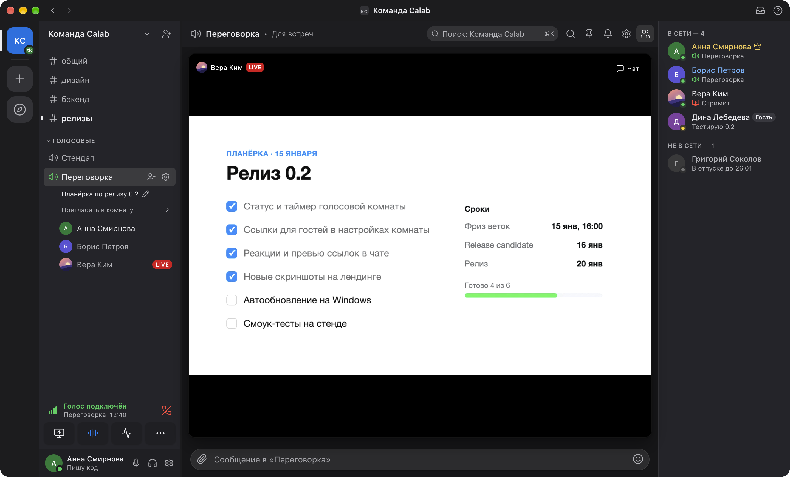

<p align="center">
  
</p>

<h1 align="center">Calab</h1>

<p align="center">
  Голосовые комнаты, чат и стрим экрана для команды — на вашем сервере.<br>
  <sub>Self-hosted voice-first team messenger: voice rooms, Telegram-style chat, screen sharing. macOS · Windows · Linux · Web.</sub>
</p>

<p align="center">
  <a href="LICENSE"></a>
  <a href="https://github.com/itrcz/calab/actions/workflows/ci.yml"></a>
  
  
  
  <a href="https://calab.ru"></a>
</p>

<p align="center">
  <picture>
    <source media="(prefers-color-scheme: light)" srcset="docs/images/chat-light-shadow@2x.png">
    
  </picture>
</p>

---

## Что это

Calab — корпоративный мессенджер, в котором главное — **голос**. Зашёл в комнату — сразу слышишь коллег; рядом чат с файлами и реакциями; в любой момент можно показать экран. Всё работает на вашем сервере: один `docker compose up`, PostgreSQL и LiveKit внутри, никаких внешних сервисов и подписок.

Рассчитан на команды до 20–30 человек одновременно в голосе и до 3 стримов в комнате (MVP); масштабируется через Kubernetes.

## Чем вдохновлялись

| | Откуда | Что взяли |
|---|---|---|
| 🎙 | **Discord** | структуру корпоративного войс-мессенджера: пространства → комнаты → участники, push-to-talk и активация голосом, роли и права на каждую комнату, перетаскивание участников, гостевые ссылки |
| 💬 | **Telegram** | удобный чат: пузыри сообщений, ответы, реакции, упоминания, превью ссылок, файлы и изображения, контекстное меню, поиск |
| 📶 | **Zoom** | стабильный коннект и экономию трафика: адаптивная подписка на видео, simulcast, Opus DTX, автоматический откат UDP → TCP → TURN/TLS на 443, чтобы работало за VPN и корпоративными файрволами |

## Возможности

### 🎙 Голос
- **Комнаты** — вход одним кликом, участники и говорящие видны прямо в списке комнат (кольцо у аватара), таймер разговора, лимит участников `N/M`.
- **Микрофон** — активация голосом с настраиваемым порогом и гистерезисом или **push-to-talk** на любую клавишу: Caps Lock (с опцией «не менять регистр»), F13–F19, модификаторы, боковые кнопки мыши; глобальные хоткеи mute / deafen.
- **Чистый звук** — эхоподавление AEC3, шумоподавление RNNoise (без внешних сервисов), Opus с DTX: в тишине ~0,1 кбит/с, на речи 30–45 кбит/с; личный потолок битрейта для роуминга.
- **Устройства** — быстрый выбор микрофона и вывода из панели, переключение на лету, автоматический откат при отключении гарнитуры, громкость каждого участника отдельно.
- **Запись встреч** — любой участник включает запись из меню комнаты (REC видят все), сервер пишет звук (LiveKit Egress) и отправляет в **GPTunneL** на транскрибацию и саммари; в чате — карточка со ссылкой.
- **Модерация** — серверный mute, отключение, перемещение между комнатами drag&drop, остановка чужого стрима.
- **Статусы** — онлайн / отошёл (авто-AFK по бездействию) / не беспокоить / невидимка, кастомный статус с эмодзи и сроком.

### 🖥 Стрим экрана
- Пикер как в Discord: приложения и экраны с превью, пресеты **Экономия · 720p · 1080p · Оригинал**, режим «Текст / Видео», системный звук (где ОС позволяет исключить голоса участников).
- **AV1 + simulcast**: статичный код или документ — ~20–300 кбит/с; зритель получает только тот слой, который реально видит (превью — 640×360, развёрнутый — полный); слой, который никто не смотрит, не кодируется.
- Просмотр: плитка в углу чата, развёрнутый режим, отдельное окно для второго монитора, полный экран, выбор качества, до 3 стримов в комнате, счётчик «N смотрят».

### 💬 Чат
- Пузыри как в Telegram: группировка по автору, ответы с цитатой, **реакции**, редактирование и удаление, закреплённые сообщения, галочки отправлено / доставлено.
- **Упоминания** `@user`, `@everyone` / `@here` (по праву), инбокс упоминаний, бейджи непрочитанных и упоминаний с сервера, липкий баннер «N новых», переход к первому непрочитанному.
- **Файлы** — drag&drop, вставка из буфера, превью изображений (WebP-миниатюры на сервере), лайтбокс, квоты на пространство, скачивание с карантинной пометкой ОС.
- **Превью ссылок** (OpenGraph через сервер с защитой от SSRF), markdown-lite (жирный, курсив, код), эмодзи-пикер.
- **Поиск** — по комнате и по всему пространству с морфологией (PostgreSQL FTS), быстрый переход `⌘K` по комнатам, участникам и сообщениям.
- Уведомления на комнату: все / только упоминания / выключить (на время или навсегда), системные уведомления, звуки событий — каждый отключается отдельно.

### ✉️ Личные сообщения и телефон
- **Личные сообщения** — отдельный раздел в рейле со счётчиком непрочитанных; переписка с любым участником общих пространств, та же лента, что в комнатах (файлы, реакции, закрепы).
- **Мобильная версия** веб-клиента: одна колонка, комнаты и переписки в шторке, голос и push-to-talk внизу экрана; ставится на главный экран телефона.

<p align="center">
  <picture>
    <source media="(prefers-color-scheme: light)" srcset="docs/images/dm-light@2x.png">
    
  </picture>
  &nbsp;
  
</p>

### 🏢 Пространства и права
- Пространства с категориями комнат, текстовые и голосовые комнаты, приватные комнаты.
- Роли **owner / admin / member / guest** и 14 битов прав с переопределением на каждую комнату (просмотр, писать, файлы, подключаться, говорить, стримить, упоминать всех, модерация, управление…); открытые и закрытые пространства, инвайт-ссылки с лимитом и сроком.
- **Гостевые ссылки на комнату** — человек вводит имя и оказывается в разговоре без регистрации, видит только эту комнату; админ может сделать гостя участником.
- Никнеймы в пространстве, переименование участников, история сеансов с завершением на других устройствах, смена пароля и email.

### 🤖 Боты
- **Бот — это пользователь** с токеном: тот же REST и gateway, права — через роли, как у людей. Пишет и читает чат, отвечает на `/команды`, реагирует, работает в DM; события — по WebSocket или webhook с HMAC-подписью.
- **Голос**: бот входит в голосовую комнату через LiveKit — слышит участников и говорит сам (Node, Python, Go).
- SDK на TypeScript (`packages/bot-sdk`), примеры (`examples/bots`: echo, голосовое эхо, TTS, Python) и документация — [docs/19-bot-api.md](docs/19-bot-api.md) · [English](docs/19-bot-api.en.md).

### 🔒 Надёжность и безопасность
- **Работает везде**: UDP → ICE/TCP → TURN/UDP 443 → TURN/TLS 443 автоматически; один публичный IP; проверено из-за VPN и через relay.
- **Переподключение без потерь**: gateway с последовательностью событий и `RESUME`, восстановление после сна ноутбука и обрыва сети, оптимистичная отправка с идемпотентностью.
- Медиа — DTLS-SRTP; API — HTTPS/WSS, HSTS, строгая CSP, cookie `HttpOnly/SameSite=Strict` для веба, CSRF по Origin; argon2id, ротация refresh-токенов с детекцией повторного использования; rate-limit на вход, регистрацию, загрузки и создание пространств.
- Electron: `contextIsolation` + `sandbox`, узкий IPC с проверкой отправителя, quarantine на скачиваниях, обновления только с вашего сервера по HTTPS.

### 🚀 Эксплуатация
- **Docker Compose** с харднингом контейнеров (read-only, без capabilities), автоматические сертификаты Let's Encrypt, ежедневные бэкапы с проверенным восстановлением, Prometheus-метрики.
- Единый образ API ~20 MB, ~40 MB RAM в простое; READY-снапшот для 100 комнат — 6 мс.
- **Desktop + Web** из одного кода: Electron для macOS (Apple Silicon / Intel), Windows, Linux (AppImage / deb) и браузерная версия на `app.<домен>`; автообновление с `/download/`.

<p align="center">
  <picture>
    <source media="(prefers-color-scheme: light)" srcset="docs/images/stream-light@2x.png">
    
  </picture>
</p>

## Архитектура

```
Desktop (Electron) / Web ──HTTPS/WSS──▶ Caddy :443 ──▶ Go API + WS gateway ──▶ PostgreSQL, Valkey
            │                              │  SNI turn.* ──▶ LiveKit TURN/TLS
            └──────── WebRTC (UDP 7882 · TCP 7881 · TURN 443) ──▶ LiveKit SFU
```

| Слой | Технология |
|---|---|
| Клиент | Electron 44, React 19, TypeScript, `livekit-client`, AudioWorklet (RNNoise) |
| Медиа | LiveKit (SFU, встроенный TURN), Opus DTX, AV1 simulcast |
| Сервер | Go, `net/http`, `coder/websocket`, `pgx` + `sqlc`, protobuf-контракт (`buf`) |
| Данные | PostgreSQL 18, Valkey 9, локальное файловое хранилище (S3-драйвер в планах) |
| Edge | Caddy + layer4 (HTTPS и TURN/TLS на одном 443) |

Подробно: [архитектура](docs/01-architecture.md) · [медиа](docs/02-media.md) · [сеть](docs/03-network.md) · [модель данных и права](docs/04-data-model.md) · [realtime-протокол](docs/05-realtime-protocol.md) · [Bot API](docs/19-bot-api.md) · [деплой](docs/06-deployment.md) · [дизайн-система](docs/08-design.md) · [бренд и домены](docs/10-branding.md) · [ADR](docs/adr/).

## Быстрый старт

### Свой сервер

Нужны: Linux-хост с публичным IP, Docker + Compose, домен с A-записями `app`, `rtc`, `turn` (и `@` для лендинга).

```bash
git clone https://github.com/itrcz/calab.git && cd calab
cp infra/docker/.env.example infra/docker/.env   # DOMAIN, секреты — см. комментарии
infra/docker/deploy.sh                            # Caddy, LiveKit, API, Postgres, Valkey
```

Порты: `80/443` TCP, `443/UDP`, `7881/TCP`, `7882/UDP`. Первый зарегистрированный пользователь становится владельцем сервера; дальше — по инвайтам. Полная инструкция, бэкапы и харднинг — в [docs/06-deployment.md](docs/06-deployment.md).

### Приложение

Сборки для macOS, Windows и Linux — на `https://app.<домен>/download/` (для публичного сервера — [app.calab.ru/download](https://app.calab.ru/download/)). Веб-версия — по тому же адресу без `/download`.

Что нового в каждой версии — в [CHANGELOG.md](CHANGELOG.md) (тот же текст попадает в описание [GitHub Release](https://github.com/itrcz/calab/releases)).

### Разработка

```bash
corepack enable && pnpm install && make gen       # protobuf → Go + TS
pnpm infra:dev                                    # Postgres, Valkey, LiveKit --dev
cd apps/server && go run ./cmd/server serve       # API на :3000
pnpm -F @calaba/desktop dev                       # Electron
```

Проверки: `make test` (Go + TS), `make test-integration`, `pnpm -F @calaba/desktop e2e:visual` (252 эталонных снимка, axe, инварианты раскладки). Сценарии ручного тестирования — в [TESTING.md](TESTING.md).

## Структура репозитория

```
apps/desktop      Electron-клиент и веб-сборка (общий renderer, слой platform)
apps/server       Go API + WebSocket gateway, миграции, sqlc
apps/landing      сайт calab.ru (Next.js static export)
packages/protocol TS-контракт из protobuf, права, пресеты
packages/bot-sdk  SDK для ботов (TypeScript)
examples/bots     примеры ботов: echo, voice-echo, tts, Python
proto/            protobuf — единственный источник контракта
infra/docker      compose, Caddy, LiveKit, бэкапы, релизный runbook
docs/             архитектура, дизайн, ADR
```

## Тарифы

| | Free | Team | Self-hosted |
|---|---|---|---|
| Голосовая комната | до 5 человек | до 50 человек | без ограничения |
| Стрим и камера | до 720p / 15 fps, 1 стрим на комнату | без ограничений качества | без ограничений качества |
| Файлы | 1 ГБ на пространство | без ограничения | без ограничения |
| Поддержка | — | приоритетная | — |
| Цена | бесплатно | по запросу (**it@gptunnel.ai**) | бесплатно для некоммерческого использования (BSL 1.1, «Powered by GPTunneL»); коммерческая лицензия — по запросу |

Free и Team — облачные лимиты пространства (см. [ADR-0024](docs/adr/0024-plans-and-limits.md)); Self-hosted — свой сервер по лицензии из раздела [«Лицензия»](#лицензия) ниже. Подробности и цены по тарифам — на [странице «Тарифы»](https://calab.ru/ru/#pricing) лендинга и в [COMMERCIAL-LICENSE.md](COMMERCIAL-LICENSE.md).

## Статус

v0.1 — MVP: голос, чат, стрим, права, гости, desktop + web. Дальше: S3-хранилище, Helm-чарт, SSO/OIDC, треды, запись комнат, подписанные сборки. Бэклог — [docs/09-ui-backlog.md](docs/09-ui-backlog.md), план — [docs/07-roadmap.md](docs/07-roadmap.md).

## Лицензия

**Business Source License 1.1** — [LICENSE](LICENSE).

- Некоммерческое использование (личное, НКО, образование, оценка до 30 дней) — **бесплатно**, с упоминанием «Powered by GPTunneL» в интерфейсе и сохранением [NOTICE](NOTICE).
- Коммерческое использование — по лицензии GPTunneL: [COMMERCIAL-LICENSE.md](COMMERCIAL-LICENSE.md), **it@gptunnel.ai**.
- Каждая версия становится Apache-2.0 через четыре года после выпуска.

Названия и логотипы Calab и GPTunneL — товарные знаки, см. [TRADEMARKS.md](TRADEMARKS.md).

## Участие и безопасность

Правки принимаются через pull request с CLA — [CONTRIBUTING.md](CONTRIBUTING.md). Уязвимости — приватно на **it@gptunnel.ai**, см. [SECURITY.md](SECURITY.md).

<p align="center"><sub>© 2026 GPTunneL · Powered by <a href="https://gptunnel.ai">GPTunneL</a></sub></p>
