<p align="center"><b>English</b> · <a href="README.ru.md">Русский</a> · <a href="README.es.md">Español</a> · <a href="README.zh-CN.md">简体中文</a></p>

<p align="center">
  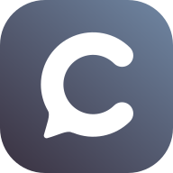
</p>

<h1 align="center">Calab</h1>

<p align="center">
  Your whole team in one window: voice rooms, chat, meetings and tasks — on your own server.<br>
  <sub>Self-hosted voice-first team messenger. macOS · Windows · Linux · Web.</sub>
</p>

<p align="center">
  <a href="LICENSE"></a>
  <a href="https://github.com/itrcz/calab/actions/workflows/ci.yml"></a>
  
  
  
  <a href="https://calab.ru/en/"></a>
</p>

<p align="center">
  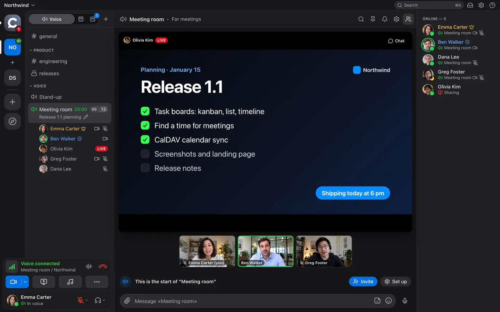
</p>

---

## What it is

Calab is a team messenger where **voice** comes first. Join a room and you hear your colleagues right away; next to it is a Telegram-style chat, a calendar with meetings and Linear-style task boards. Everything runs on your own server: one `docker compose`, PostgreSQL and LiveKit inside, no external services or subscriptions.

It is built for teams of up to 20–30 people in voice at once and up to 3 screen shares per room. The client is light: 0.05 % CPU outside a call and ≈ 7 % in voice on a MacBook Air M4.

## Features

### 🎙 Voice and video

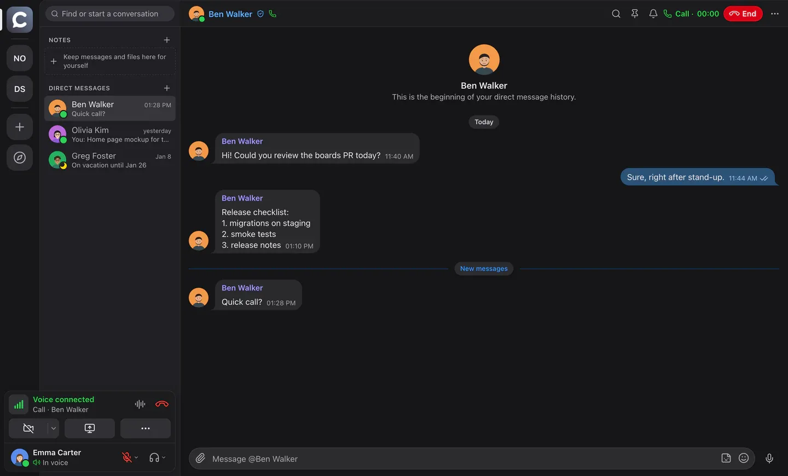

- **Voice rooms** — one click to join; who is talking is visible right in the room list; room status, timer and member limit.
- **Clean sound** — AEC3 echo cancellation and RNNoise noise suppression (no external services), Opus with DTX; voice activation or **push-to-talk** on any key, even in the background.
- **Screen sharing** in AV1 or hardware H.264 with simulcast — each viewer gets the quality their connection allows; viewers can point and draw on top of the stream.
- **Camera** with background blur or a picture (built-in and workspace backgrounds).
- **One-on-one calls** in direct messages, with ringing, camera and screen sharing.
- **Meeting recordings** — the server records, GPTunneL transcribes; a card with the summary, audio and full transcript arrives in the room chat.
- **Soundboard**, moderation (server mute, disconnect, move by drag and drop), statuses.

### 💬 Chat

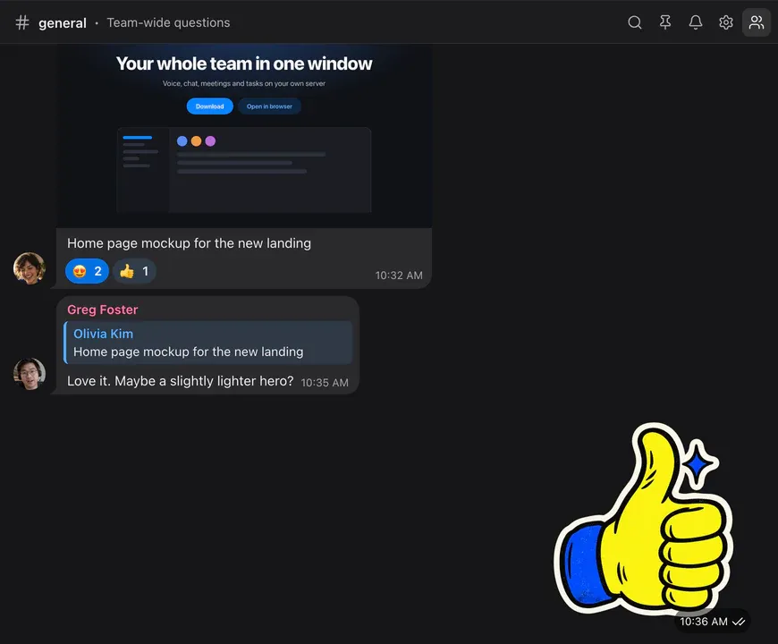

- Bubbles like Telegram: replies, **reactions**, forwarding to several chats, stickers, voice messages, files with previews, pins, read ticks.
- **Mentions**, per-room notifications, workspace search with morphology, `⌘K` quick switcher.
- **Direct messages** with an archive; the web app adapts to phones and installs to the home screen.

### 📅 Calendar and meetings

<table>
  <tr>
    <td width="50%">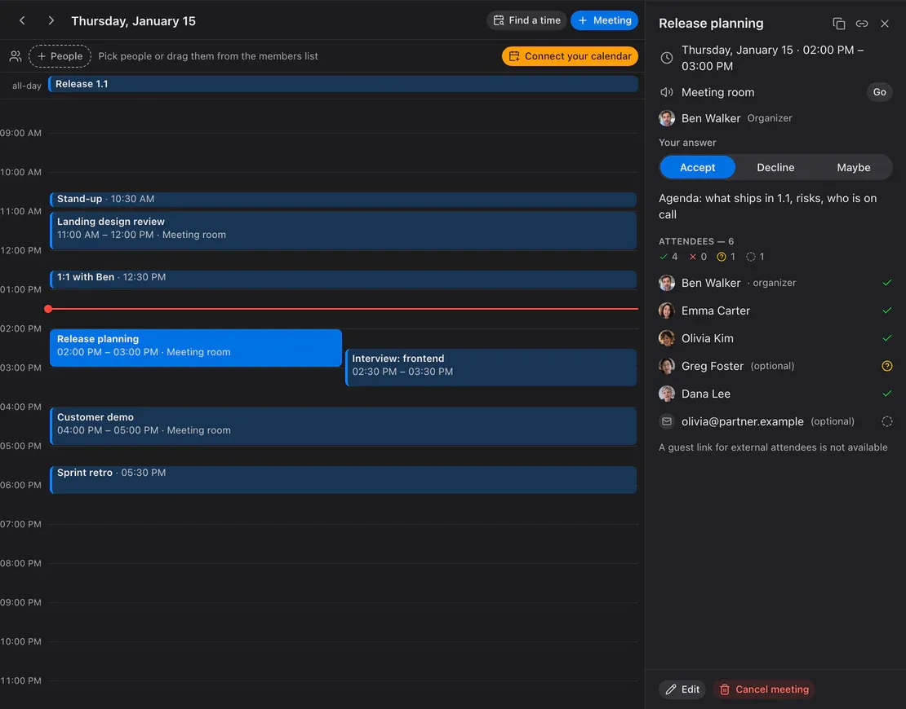</td>
    <td width="50%">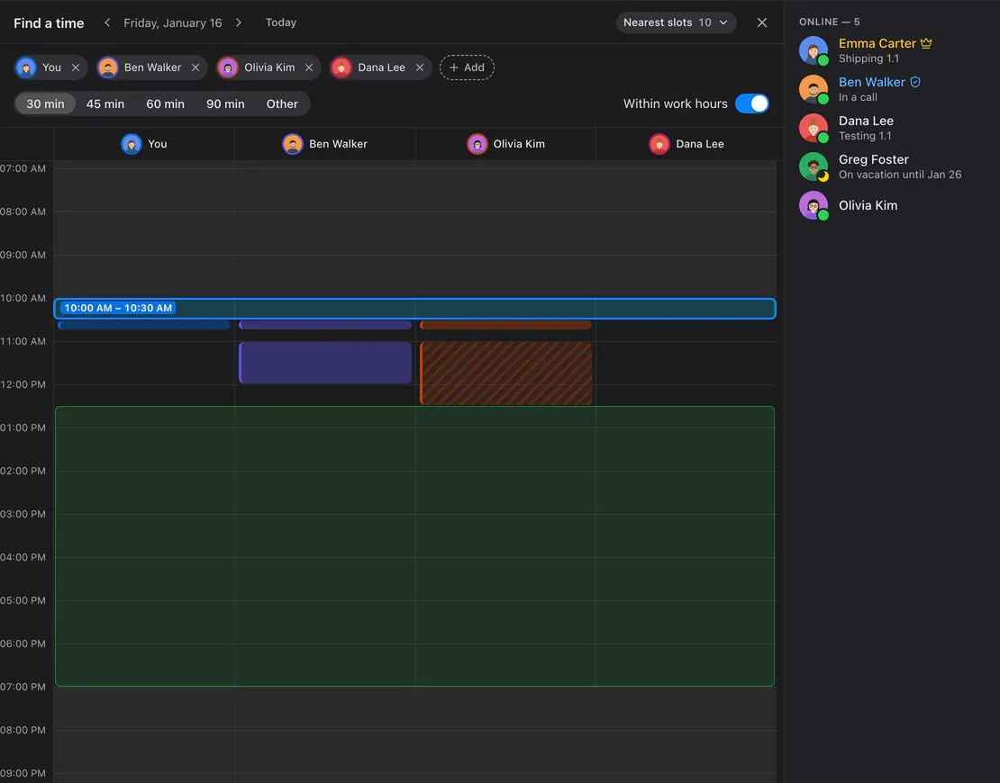</td>
  </tr>
</table>

- A day view with meetings side by side, the meeting card with attendees and answers, the room with a “Go” button, recurring meetings, reminders.
- **Invitations by email** with `invite.ics` — the meeting lands in Apple, Google, Outlook or Yandex calendars; external attendees answer by link and join as guests.
- **Find a time** — colleagues’ busy columns, shared free windows and the nearest slots within everyone’s work hours.
- **CalDAV** — connect Yandex, iCloud, Fastmail or Nextcloud: your busy time counts, Calab meetings appear there by themselves.

### ✅ Task boards

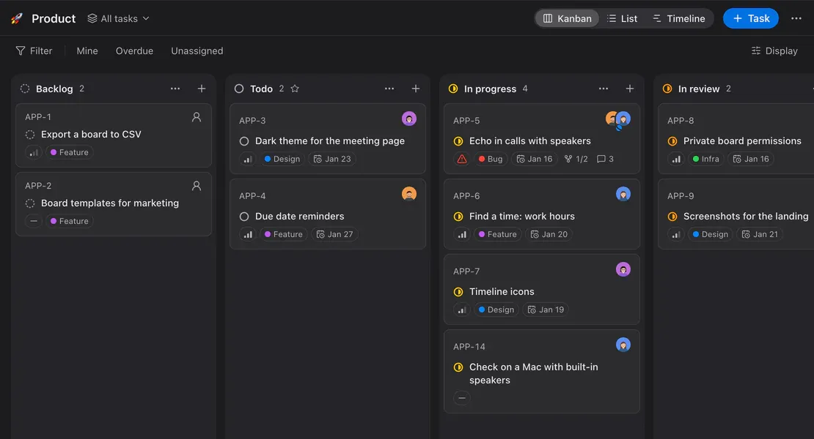

<table>
  <tr>
    <td width="68%">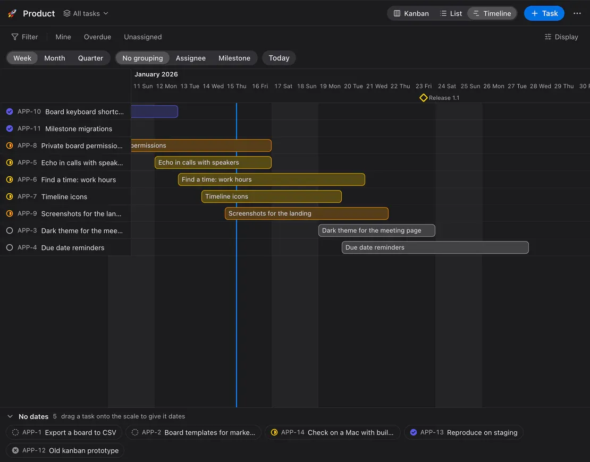</td>
    <td width="32%">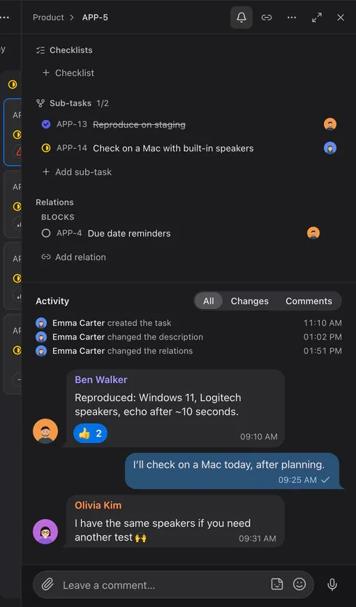</td>
  </tr>
</table>

- **Kanban, list and timeline** (Gantt with milestones and a “today” line), in the spirit of Linear, with its keyboard shortcuts.
- Statuses, priorities, labels, milestones, due dates; several assignees with a lead, subtasks and relations.
- Comments like chat — reactions, stickers, voice messages — mixed with the change history.
- Filters, saved views, bulk actions; **create a task from any message**; a task link unfolds into a card in the chat.

### 📝 Notes

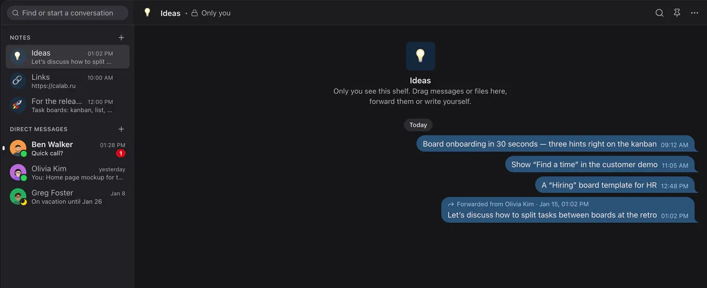

Up to 20 private shelves with your own names and emoji — like Saved Messages in Telegram, only several. Drag messages and files onto a shelf, forward to it, pin and search.

### 🚪 Guests and approval

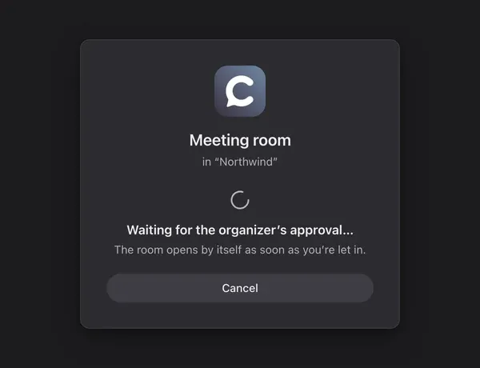

A guest link leads straight into a room — no sign-up. With approval turned on (per room or per link), the guest waits on this screen until the organizer clicks “Let in”.

### 🤖 Bots and SDK

A bot is a member with a token: the same REST and gateway as the app, rights through roles. It reads and writes chat, answers `/commands`, talks in voice rooms (LiveKit, Node / Python / Go) and works with boards within its rights; events arrive over WebSocket or a webhook with an HMAC signature.

```ts
import { Bot } from '@calaba/bot-sdk';

const bot = new Bot(process.env.BOT_TOKEN, { server: 'https://app.calab.ru' });
bot.on('message', (m) => bot.reply(m, m.content));
await bot.start();
```

SDK — [`packages/bot-sdk`](packages/bot-sdk), examples — [`examples/bots`](examples/bots) (echo, voice echo, TTS, Python), docs — [docs/19-bot-api.en.md](docs/19-bot-api.en.md) · [Русский](docs/19-bot-api.md).

### 🔒 Self-hosted and secure

- **Works everywhere**: UDP → ICE/TCP → TURN/UDP 443 → TURN/TLS 443 automatically; one public IP; tested behind VPNs.
- Media — DTLS-SRTP; API — HTTPS/WSS, HSTS, strict CSP, `HttpOnly/SameSite=Strict` cookies for the web, argon2id, refresh-token rotation with reuse detection, rate limits. No end-to-end encryption yet: media goes through your own media server.
- Every right (rooms, boards, calendar) is checked on the server; the LiveKit grant mirrors the rights.
- **Docker Compose** with hardened containers, automatic Let’s Encrypt certificates, daily backups with verified restore, Prometheus metrics; PostgreSQL 17 or 18.

## Quick start

### Your own server

You need a Linux host with a public IP, Docker + Compose and a domain with A records for `app`, `rtc`, `turn` (and `@` for the site).

```bash
git clone https://github.com/itrcz/calab.git && cd calab
cp infra/docker/.env.example infra/docker/.env   # DOMAIN, secrets — see the comments
infra/docker/deploy.sh                            # Caddy, LiveKit, API, Postgres, Valkey
```

Ports: `80/443` TCP, `443/UDP`, `7881/TCP`, `7882/UDP`. The first registered user becomes the server owner; everyone else joins by invitation. The full guide, backups and hardening — [docs/06-deployment.md](docs/06-deployment.md).

### The app

Builds for macOS, Windows and Linux are at [calab.ru](https://calab.ru/en/#download) and on your server at `https://app.<domain>/download/`; the web app is at `https://app.<domain>`. What’s new in each version — [CHANGELOG.md](CHANGELOG.md) (in Russian; the same text goes into [GitHub Releases](https://github.com/itrcz/calab/releases)).

### Development

```bash
corepack enable && pnpm install && make gen       # protobuf → Go + TS
pnpm infra:dev                                    # Postgres, Valkey, LiveKit --dev
cd apps/server && go run ./cmd/server serve       # API on :3000
pnpm -F @calaba/desktop dev                       # Electron
```

Checks: `make test` (Go + TS), `make test-integration`, visual tests per screen (`pnpm -F @calaba/desktop e2e:visual -g "<screen>"`). Architecture: [overview](docs/01-architecture.md) · [media](docs/02-media.md) · [network](docs/03-network.md) · [data model and rights](docs/04-data-model.md) · [realtime protocol](docs/05-realtime-protocol.md) · [design system](docs/08-design.md) · [ADR](docs/adr/).

## Plans

| | Free | Team | Business | Enterprise (your own server) |
|---|---|---|---|---|
| Voice room | up to 5 people | up to 15 people | up to 50 people | unlimited |
| Workspace members | up to 50 | up to 100 | up to 500 | unlimited |
| Audio quality | up to “Normal” | any, up to “Excellent” | any | any |
| Screen sharing and camera quality | up to 720p / 15 fps | no quality limits | no quality limits | no quality limits |
| Screen shares at once in a room | 1 | 2 | 5 | unlimited |
| Cameras at once in a room | 3 | 10 | 25 | unlimited |
| Files | 5 GB per workspace | 300 GB per workspace | 1 TB per workspace | unlimited |
| Bots | 1 | 5 | 20 | unlimited |
| Sticker packs | 1 | unlimited | unlimited | unlimited |
| Task boards | 3 | 30 | 50 | unlimited |
| Calendar | ✓ | ✓ | ✓ | ✓ |
| CalDAV sync | — | ✓ | ✓ | ✓ |
| Task approvals | — | — | ✓ | ✓ |
| Embedded web apps | — | — | ✓ | ✓ |
| Telephony (SIP) | — | — | ✓ | ✓ |
| White-label | — | — | — | ✓ |
| Support | — | support | priority | — |
| Price | free | on request (**it@gptunnel.ai**) | on request (**it@gptunnel.ai**) | free for non-commercial use (BSL 1.1, “Powered by GPTunneL”); commercial licence on request |

Free, Team and Business are cloud plans of a workspace ([ADR-0024](docs/adr/0024-plans-and-limits.md)); Enterprise is your own server with no plan limits. CalDAV belongs to a person: it works if any of their workspaces is on Team or above. Details — [calab.ru/en/#pricing](https://calab.ru/en/#pricing) and [COMMERCIAL-LICENSE.md](COMMERCIAL-LICENSE.md).

## Licence

**Business Source License 1.1** — [LICENSE](LICENSE).

- Non-commercial use (personal, non-profits, education, evaluation up to 30 days) is **free**, with “Powered by GPTunneL” in the interface and the [NOTICE](NOTICE) kept.
- Commercial use — under a GPTunneL licence: [COMMERCIAL-LICENSE.md](COMMERCIAL-LICENSE.md), **it@gptunnel.ai**.
- Every version becomes Apache-2.0 four years after its release.

Calab and GPTunneL names and logos are trademarks, see [TRADEMARKS.md](TRADEMARKS.md).

## Contributing and security

Pull requests are welcome with a CLA — [CONTRIBUTING.md](CONTRIBUTING.md). Report vulnerabilities privately to **it@gptunnel.ai**, see [SECURITY.md](SECURITY.md).

<p align="center"><sub>© 2026 GPTunneL · Powered by <a href="https://gptunnel.ai">GPTunneL</a></sub></p>
