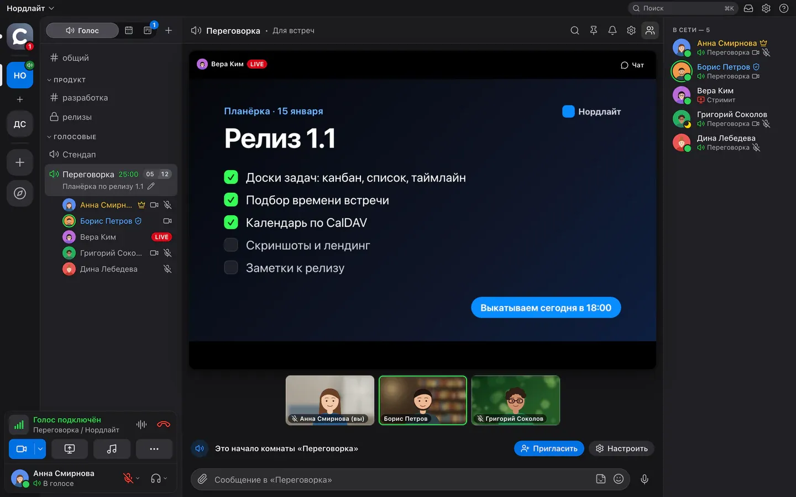
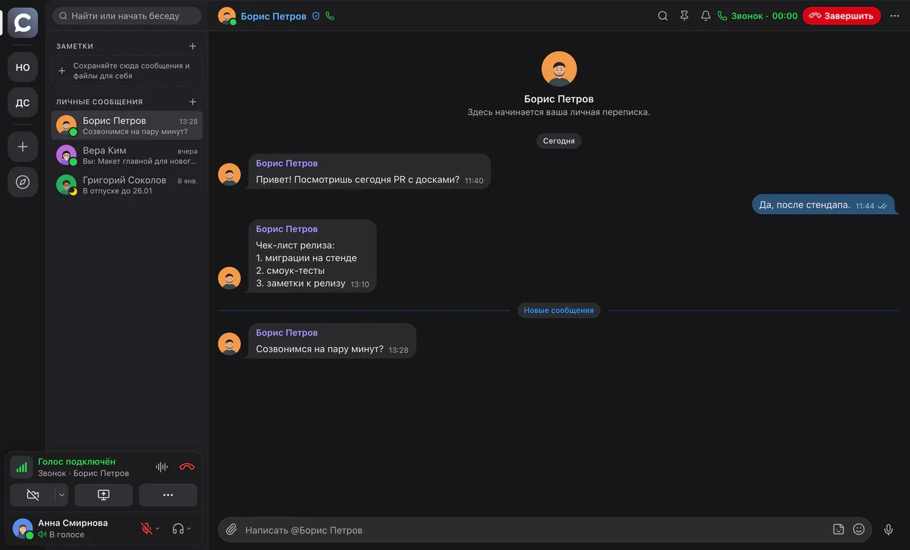
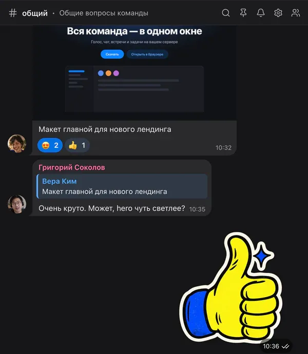
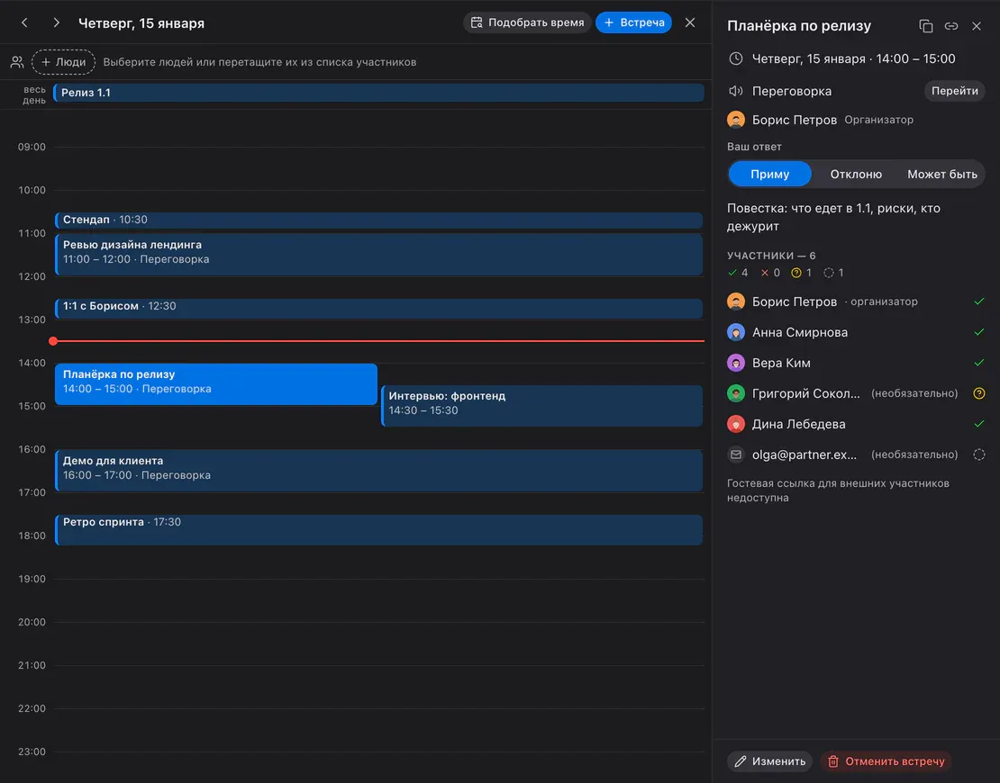
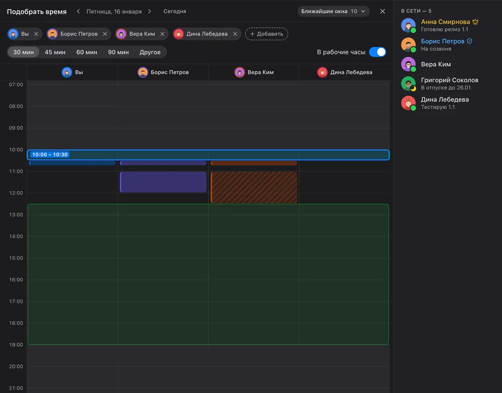
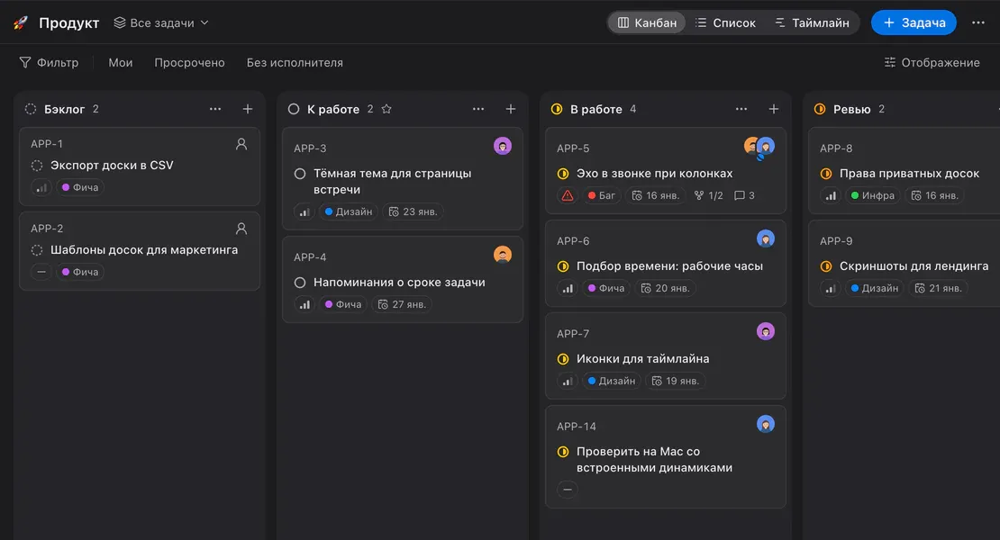
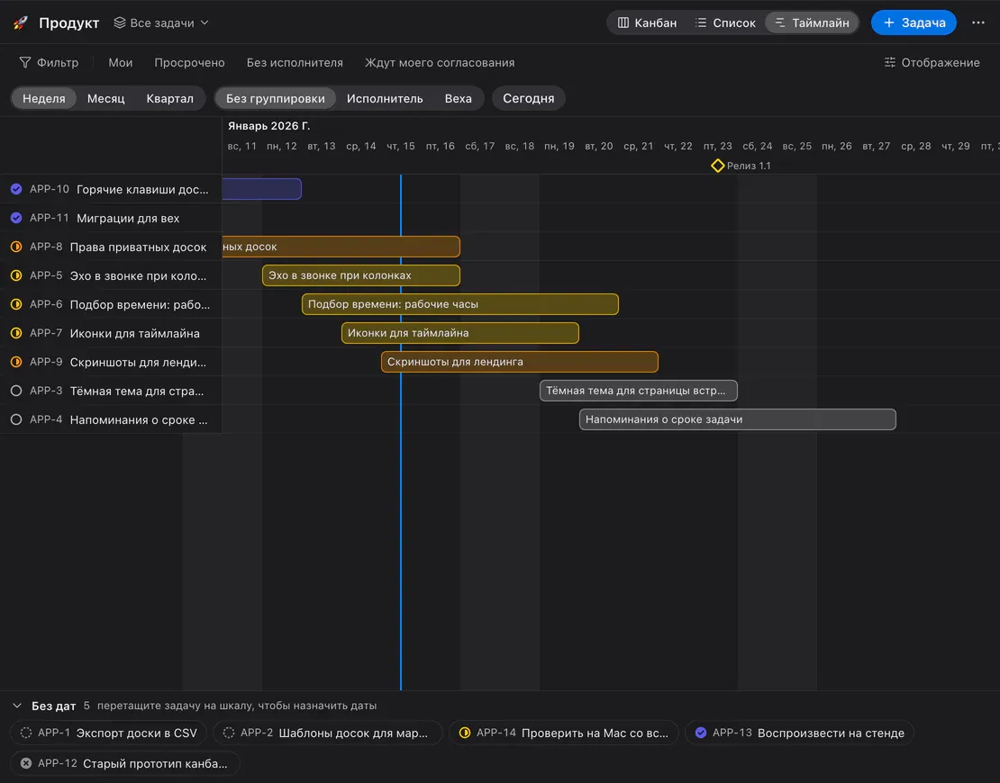
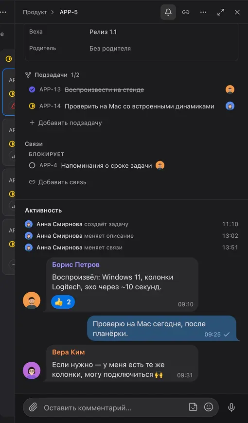
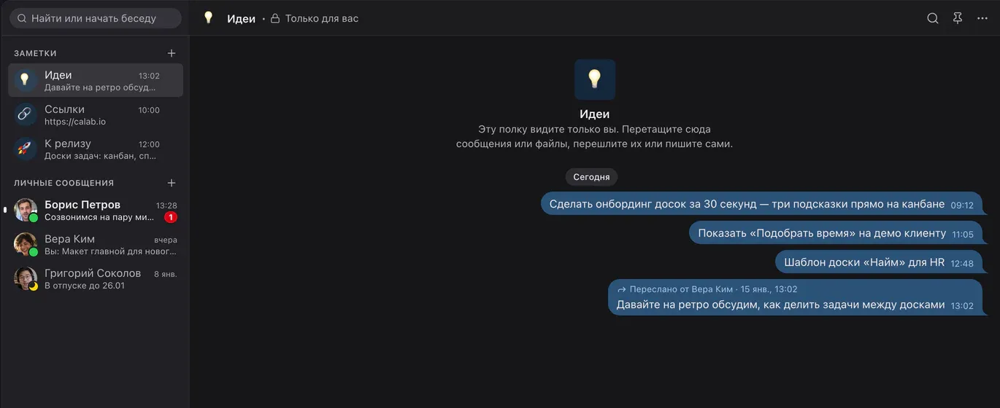
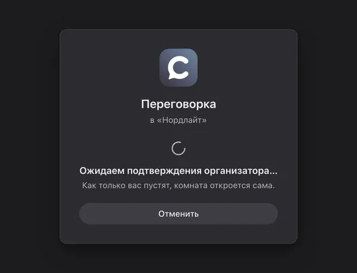

<p align="center"><a href="README.md">English</a> · <b>Русский</b> · <a href="README.es.md">Español</a> · <a href="README.zh-CN.md">简体中文</a></p>

<p align="center">
  
</p>

<h1 align="center">Calab</h1>

<p align="center">
  Вся команда — в одном окне: голосовые комнаты, чат, встречи и задачи на вашем сервере.<br>
  <sub>Self-hosted voice-first мессенджер для команды. macOS · Windows · Linux · веб.</sub>
</p>

<p align="center">
  <a href="LICENSE"></a>
  <a href="https://github.com/itrcz/calab/actions/workflows/ci.yml"></a>
  
  
  
  <a href="https://calab.ru/ru/"></a>
</p>

<p align="center">
  
</p>

---

## Что это

Calab — мессенджер для команды, в котором главное — **голос**. Зашли в комнату — и сразу слышите коллег; рядом чат как в Telegram, календарь со встречами и доски задач в духе Linear. Всё работает на вашем сервере: один `docker compose`, PostgreSQL и LiveKit внутри, никаких внешних сервисов и подписок.

Рассчитан на команды до 20–30 человек одновременно в голосе и до 3 стримов в комнате. Клиент лёгкий: 0,05 % CPU без звонка и ≈ 7 % в голосе на MacBook Air M4.

## Возможности

### 🎙 Голос и видео



- **Голосовые комнаты** — вход одним кликом, говорящие видны прямо в списке комнат; статус комнаты, таймер и лимит участников.
- **Чистый звук** — эхоподавление AEC3 и шумоподавление RNNoise (без внешних сервисов), Opus с DTX; активация голосом или **push-to-talk** на любую клавишу, в том числе в фоне.
- **Режим музыканта** — личный переключатель: выключает эхоподавление, шумоподавление и автоусиление и переводит Opus в музыкальный профиль (128 кбит/с моно / 192 кбит/с стерео, FEC, без DTX): играйте на инструменте или пойте вживую, и обработка не съест звук. Нужны наушники; остальные видят значок гитары рядом с вашим именем. Тариф Team и выше.
- **Показ экрана** в AV1 или аппаратном H.264 с simulcast — каждый зритель получает качество под свой канал; зрители показывают указкой и рисуют поверх стрима.
- **Камера** с размытием или картинкой вместо фона (встроенные и фоны пространства).
- **Звонки один на один** в личных сообщениях — с рингтоном, камерой и показом экрана.
- **Записи встреч** — запись ведёт сервер, расшифровку делает GPTunneL; в чат комнаты приходит карточка с саммари, аудио и полным транскриптом.
- **Саундборд**, модерация (серверный mute, отключение, перемещение перетаскиванием), статусы.
- **Звонки на телефон (SIP)** — подключите своего SIP-провайдера и набирайте городской или мобильный номер из голосовой комнаты; абонент входит участником, все видят «Набор → Идёт вызов → На связи». Настройки провайдера, журнал звонков, право «Звонить на номера», которого по умолчанию нет ни у кого ([ADR-0046](docs/adr/0046-sip-telephony.md)).
- **Временные комнаты** — комната на час или на день с готовой гостевой ссылкой и встречей в календаре по желанию: замена Zoom, которая исчезает сама ([ADR-0044](docs/adr/0044-temp-rooms.md)).

### 💬 Чат



- Пузыри как в Telegram: ответы, **реакции**, пересылка сразу в несколько чатов, стикеры, голосовые, файлы с превью, закрепы, галочки прочтения.
- **Упоминания**, уведомления на комнату, поиск по пространству с морфологией, быстрый переход `⌘K`.
- **Личные сообщения** с архивом; веб-версия подстраивается под телефон и ставится на главный экран.

### 📅 Календарь и встречи

<table>
  <tr>
    <td width="50%"></td>
    <td width="50%"></td>
  </tr>
</table>

- День со встречами бок о бок, карточка встречи с участниками и ответами, комната с кнопкой «Перейти», повторы, напоминания.
- **Приглашения на почту** с `invite.ics` — встреча попадает в календарь Apple, Google, Outlook или Яндекса; внешние участники отвечают по ссылке и входят гостем.
- **«Подобрать время»** — колонки занятости коллег, общие свободные окна и ближайшие слоты в рабочие часы всех.
- **CalDAV** — подключите Яндекс, iCloud, Fastmail или Nextcloud: занятость учитывается, встречи Calab появляются в нём сами.

### ✅ Доски задач



<table>
  <tr>
    <td width="68%"></td>
    <td width="32%"></td>
  </tr>
</table>

- **Канбан, список и таймлайн** (Гант с вехами и линией «сегодня») в духе Linear, с его горячими клавишами.
- Статусы, приоритеты, лейблы, вехи, сроки; несколько исполнителей с ответственным, подзадачи и связи.
- Комментарии как в чате — реакции, стикеры, голосовые — вперемешку с историей изменений.
- Фильтры, сохранённые виды, массовые действия; **задача из любого сообщения**; ссылка на задачу разворачивается в чате карточкой.

- **Согласование** — назначьте согласующих и сколько одобрений нужно (все или N из M); пока задача не согласована, дальше по доске её не перенести ([ADR-0049](docs/adr/0049-task-approvals.md)).
### 📝 Заметки



До 20 личных полок со своими названиями и эмодзи — как «Избранное» в Telegram, только несколько. Перетаскивайте на полку сообщения и файлы, пересылайте, закрепляйте и ищите.

### 🚪 Гости и подтверждение входа



Гостевая ссылка ведёт прямо в комнату — без регистрации. С подтверждением (для комнаты или отдельной ссылки) гость ждёт на этом экране, пока организатор не нажмёт «Пустить».

### 🧩 Веб-приложения

Администратор закрепляет ярлыки сайтов (Grafana, вики, CRM) под иконкой пространства в левой панели. Клик открывает сайт во весь экран прямо в Calab, а звонок не прерывается; логины хранятся отдельно для каждого приложения, камера и микрофон — только с вашего разрешения ([ADR-0050](docs/adr/0050-workspace-apps.md)).

### 🤖 Боты и SDK

Бот — участник с токеном: тот же REST и gateway, что у приложения, права через роли. Пишет и читает чат, отвечает на `/команды`, говорит в голосовой комнате (LiveKit, Node / Python / Go) и работает с досками по правам; события — по WebSocket или webhook с подписью HMAC. Bot API v2 добавляет календарь (встречи, свободно/занято, подбор времени), профили участников, приглашения, бейджи, допуск гостей и запись встреч, а также кнопки под сообщениями ([ADR-0051](docs/adr/0051-bot-api-v2.md)).

```ts
import { Bot } from '@calaba/bot-sdk';

const bot = new Bot(process.env.BOT_TOKEN, { server: 'https://app.calab.ru' });
bot.on('message', (m) => bot.reply(m, m.content));
await bot.start();
```

SDK — [`packages/bot-sdk`](packages/bot-sdk), примеры — [`examples/bots`](examples/bots) (echo, голосовое эхо, TTS, Python), документация — [docs/19-bot-api.md](docs/19-bot-api.md) · [English](docs/19-bot-api.en.md).

### 🔒 Свой сервер и безопасность

- **Работает везде**: UDP → ICE/TCP → TURN/UDP 443 → TURN/TLS 443 автоматически; один публичный IP; проверено из-за VPN.
- Медиа — DTLS-SRTP; API — HTTPS/WSS, HSTS, строгая CSP, cookie `HttpOnly/SameSite=Strict` для веба, argon2id, ротация refresh-токенов с детекцией повторного использования, rate-limit. Сквозного шифрования пока нет: медиа идёт через ваш медиасервер.
- Все права (комнаты, доски, календарь) проверяет сервер; LiveKit-grant повторяет права.
- **Роли по функциям** — отдельные права на доски, участников, ботов, интеграции, журналы, события и записи; приватные и закрытые комнаты и доски, которых не видят даже администраторы ([ADR-0048](docs/adr/0048-roles-v2.md)).
- **Docker Compose** с харднингом контейнеров, автоматические сертификаты Let’s Encrypt, ежедневные бэкапы с проверенным восстановлением, Prometheus-метрики; PostgreSQL 17 или 18.

## В планах

Запланировано, пока недоступно:

- **Голосовой ИИ-ассистент** — голосовой ИИ-ассистент в комнатах (уже тестируется).
- **IVR** — голосовое меню и внутренние номера для телефонии (SIP).
- **Wiki** — база знаний команды.
- **Диск** — общее файловое хранилище пространства.

## Быстрый старт

### Свой сервер

Нужны: Linux-хост с публичным IP, Docker + Compose, домен с A-записями `app`, `rtc`, `turn` (и `@` для сайта).

```bash
git clone https://github.com/itrcz/calab.git && cd calab
cp infra/docker/.env.example infra/docker/.env   # DOMAIN, секреты — см. комментарии
infra/docker/deploy.sh                            # Caddy, LiveKit, API, Postgres, Valkey
```

Порты: `80/443` TCP, `443/UDP`, `7881/TCP`, `7882/UDP`. Первый зарегистрированный пользователь становится владельцем сервера; дальше — по приглашениям. Полная инструкция, бэкапы и харднинг — [docs/06-deployment.md](docs/06-deployment.md).

### Приложение

Сборки для macOS, Windows и Linux — на [calab.ru](https://calab.ru/ru/#download) и на вашем сервере по адресу `https://app.<домен>/download/`; веб-версия — `https://app.<домен>`. Что нового в каждой версии — [CHANGELOG.md](CHANGELOG.md) (тот же текст попадает в [GitHub Releases](https://github.com/itrcz/calab/releases)).

### Разработка

```bash
corepack enable && pnpm install && make gen       # protobuf → Go + TS
pnpm infra:dev                                    # Postgres, Valkey, LiveKit --dev
cd apps/server && go run ./cmd/server serve       # API на :3000
pnpm -F @calaba/desktop dev                       # Electron
```

Проверки: `make test` (Go + TS), `make test-integration`, визуальные тесты по экранам (`pnpm -F @calaba/desktop e2e:visual -g "<экран>"`). Архитектура: [обзор](docs/01-architecture.md) · [медиа](docs/02-media.md) · [сеть](docs/03-network.md) · [модель данных и права](docs/04-data-model.md) · [realtime-протокол](docs/05-realtime-protocol.md) · [дизайн-система](docs/08-design.md) · [ADR](docs/adr/). Сценарии ручного тестирования — [TESTING.md](TESTING.md).

## Тарифы

| | Free | Team | Business | Enterprise |
|---|---|---|---|---|
| Голосовая комната | до 5 человек | до 15 человек | до 50 человек | без ограничения |
| Участники пространства | до 50 | до 100 | до 500 | без ограничения |
| Качество звука | до «Нормальное» | любое, до «Отличное» | любое | любое |
| Стрим и камера | до 720p / 15 fps | без ограничений качества | без ограничений качества | без ограничений качества |
| Стримы одновременно | 1 | 2 | 5 | без ограничения |
| Камеры одновременно | 3 | 10 | 25 | без ограничения |
| Файлы | 5 ГБ на пространство | 300 ГБ на пространство | 1 ТБ на пространство | без ограничения |
| Боты | 1 | 5 | 20 | без ограничения |
| Стикерпаки | 1 | без ограничения | без ограничения | без ограничения |
| Доски задач | 3 | 30 | 50 | без ограничения |
| Календарь | ✓ | ✓ | ✓ | ✓ |
| CalDAV | — | ✓ | ✓ | ✓ |
| On-prem (свой сервер) | — | — | — | ✓ |
| Поддержка | — | поддержка | приоритетная | ✓ |
| Цена | бесплатно | по запросу (**it@gptunnel.ai**) | по запросу (**it@gptunnel.ai**) | бесплатно для некоммерческого использования (BSL 1.1, «Powered by GPTunneL»); коммерческая лицензия — по запросу |

Free, Team и Business — облачные тарифы пространства ([ADR-0024](docs/adr/0024-plans-and-limits.md)); Enterprise — Calab на вашем собственном сервере (on-prem), без ограничений. Подробности — [calab.ru/ru/#pricing](https://calab.ru/ru/#pricing) и [COMMERCIAL-LICENSE.md](COMMERCIAL-LICENSE.md).

## Лицензия

**Business Source License 1.1** — [LICENSE](LICENSE).

- Некоммерческое использование (личное, НКО, образование, оценка до 30 дней) — **бесплатно**, с упоминанием «Powered by GPTunneL» в интерфейсе и сохранением [NOTICE](NOTICE).
- Коммерческое использование — по лицензии GPTunneL: [COMMERCIAL-LICENSE.md](COMMERCIAL-LICENSE.md), **it@gptunnel.ai**.
- Каждая версия становится Apache-2.0 через четыре года после выпуска.

Названия и логотипы Calab и GPTunneL — товарные знаки, см. [TRADEMARKS.md](TRADEMARKS.md).

## Участие и безопасность

Правки принимаются через pull request с CLA — [CONTRIBUTING.md](CONTRIBUTING.md). Уязвимости — приватно на **it@gptunnel.ai**, см. [SECURITY.md](SECURITY.md).

<p align="center"><sub>© 2026 GPTunneL · Powered by <a href="https://gptunnel.ai">GPTunneL</a></sub></p>
