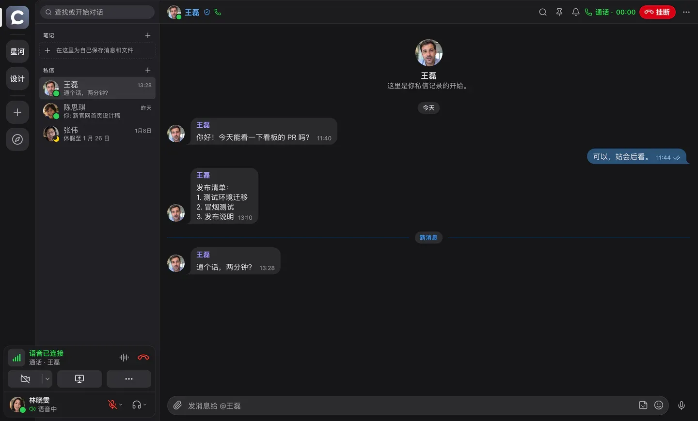
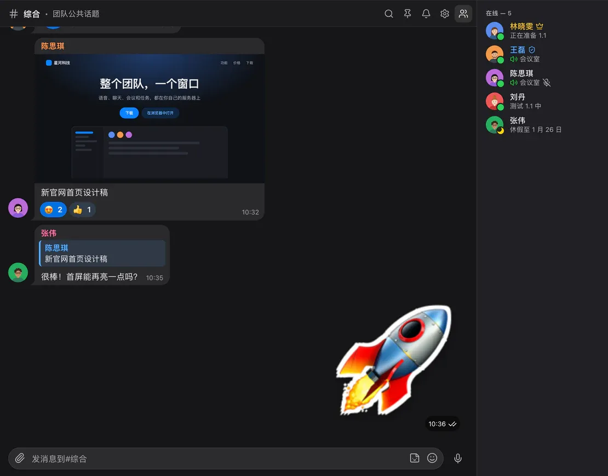
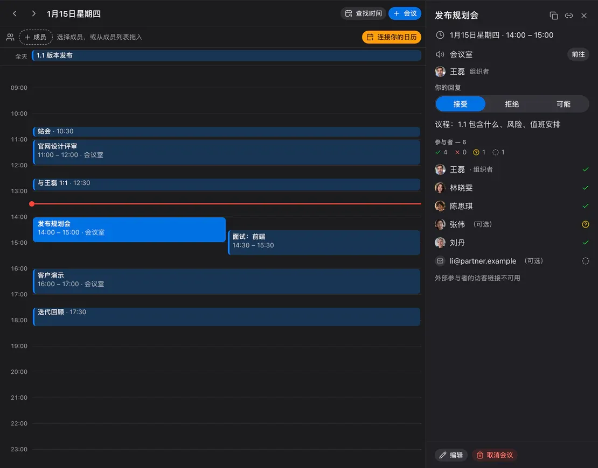
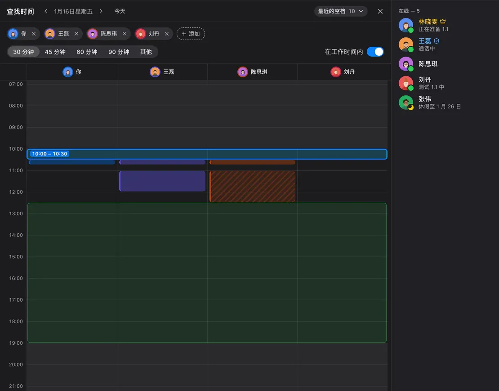
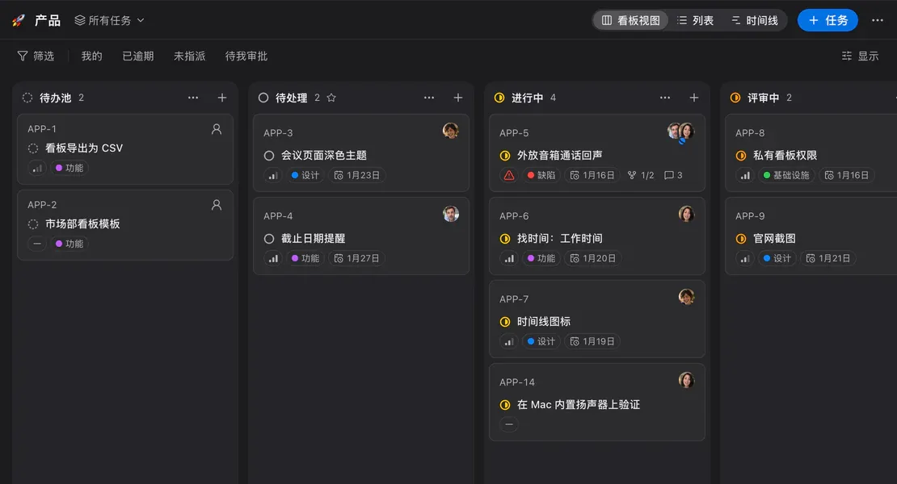
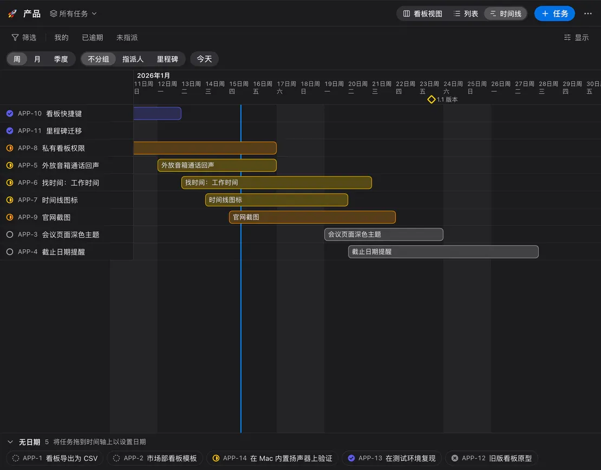
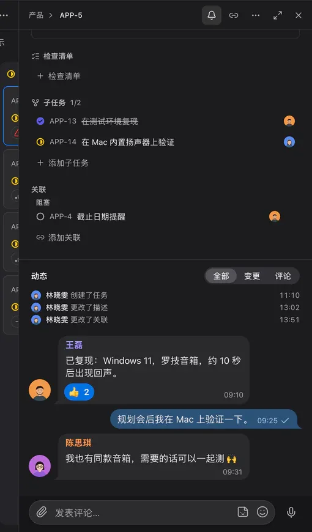
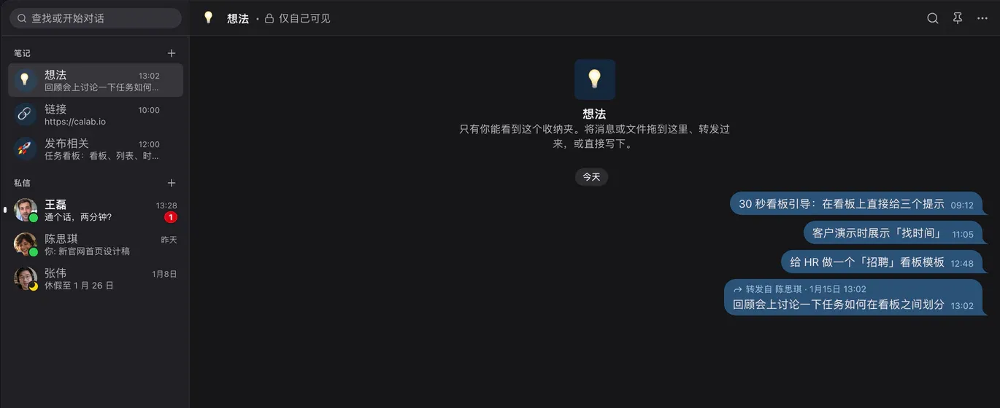
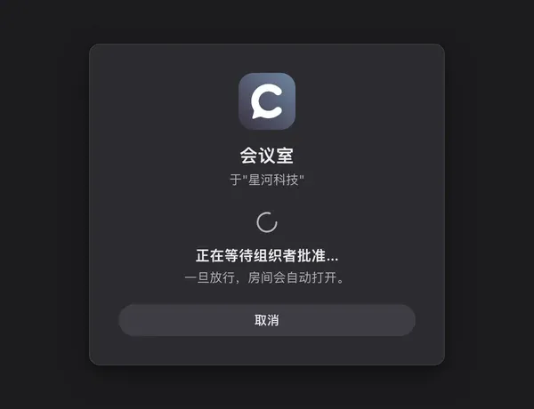

<p align="center"><a href="README.md">English</a> · <a href="README.ru.md">Русский</a> · <a href="README.es.md">Español</a> · <b>简体中文</b></p>

<p align="center">
  
</p>

<h1 align="center">Calab</h1>

<p align="center">
  整个团队，一个窗口：语音房间、聊天、会议和任务，都在你自己的服务器上。<br>
  <sub>以语音为核心的自托管团队通讯工具。macOS · Windows · Linux · 网页版。</sub>
</p>

<p align="center">
  <a href="LICENSE"></a>
  <a href="https://github.com/itrcz/calab/actions/workflows/ci.yml"></a>
  
  
  
  <a href="https://calab.ru/zh/"></a>
</p>

<p align="center">
  
</p>

---

## 这是什么

Calab 是一款以**语音**为核心的团队通讯工具。进入房间就能立刻听到同事；旁边是像 Telegram 一样的聊天、带会议的日历，以及 Linear 风格的任务看板。一切都运行在你自己的服务器上：一个 `docker compose`，内含 PostgreSQL 和 LiveKit，不依赖外部服务，也无需订阅。

适合同时在线语音 20–30 人、每个房间最多 3 路屏幕共享的团队。客户端很轻量：在 MacBook Air M4 上，未通话时 CPU 占用 0.05%，语音中约 7%。

## 功能

### 🎙 语音与视频



- **语音房间**——一键加入；谁在说话直接显示在房间列表中；房间状态、计时和人数上限。
- **清晰的声音**——AEC3 回声消除和 RNNoise 降噪（不依赖外部服务），Opus + DTX；语音激活或任意按键的**按键说话**，后台也可用。
- **屏幕共享**——AV1 或硬件 H.264，支持 simulcast：每位观看者获得与其网络匹配的画质；观看者可以在画面上指示和绘图。
- **摄像头**——背景虚化或替换图片（内置背景和工作区背景）。
- **一对一通话**——在私信中发起，支持铃声、摄像头和屏幕共享。
- **会议录音**——由服务器录制，GPTunneL 转写；房间聊天中会收到包含摘要、音频和完整转写的卡片。
- **音效板**、管理功能（服务器端静音、断开、拖动移动成员）、状态。

### 💬 聊天



- 像 Telegram 一样的气泡：回复、**表情回应**、一次转发到多个聊天、贴纸、语音消息、带预览的文件、置顶、已读标记。
- **提及**、按房间设置通知、支持词形变化的工作区搜索、`⌘K` 快速切换。
- 带归档的**私信**；网页版适配手机，可添加到主屏幕。

### 📅 日历与会议

<table>
  <tr>
    <td width="50%"></td>
    <td width="50%"></td>
  </tr>
</table>

- 日视图中会议并排显示，会议卡片包含参会者和回复，带“前往”按钮的会议房间，支持重复和提醒。
- **邮件邀请**附带 `invite.ics`——会议会加入 Apple、Google、Outlook 或 Yandex 日历；外部参会者通过链接回复，并以访客身份加入。
- **查找时间**——同事的忙闲列、共同空闲时段，以及在所有人工作时间内最近的可选时间。
- **CalDAV**——连接 Yandex、iCloud、Fastmail 或 Nextcloud：你的忙碌时间会被计入，Calab 的会议也会自动出现在其中。

### ✅ 任务看板



<table>
  <tr>
    <td width="68%"></td>
    <td width="32%"></td>
  </tr>
</table>

- **看板、列表和时间线**（带里程碑和“今天”线的甘特图），Linear 风格，并支持其快捷键。
- 状态、优先级、标签、里程碑、截止日期；多名负责人（含主负责人）、子任务和关联。
- 像聊天一样的评论——表情回应、贴纸、语音消息——与变更历史穿插显示。
- 筛选、保存的视图、批量操作；**从任意消息创建任务**；任务链接在聊天中展开为卡片。

### 📝 笔记



最多 20 个私人书架，名称和表情由你决定——就像 Telegram 的“收藏夹”，但可以有多个。可以把消息和文件拖到书架上、转发、置顶和搜索。

### 🚪 访客与审批



访客链接直达房间——无需注册。开启审批后（按房间或按链接），访客会在此界面等待，直到组织者点击“放行”。

### 🤖 机器人与 SDK

机器人是持有令牌的成员：与应用使用相同的 REST 和网关，通过角色授权。它可以读写聊天、响应 `/命令`、在语音房间中说话（LiveKit，Node / Python / Go），并按权限处理看板；事件通过 WebSocket 或带 HMAC 签名的 webhook 推送。

```ts
import { Bot } from '@calaba/bot-sdk';

const bot = new Bot(process.env.BOT_TOKEN, { server: 'https://app.calab.ru' });
bot.on('message', (m) => bot.reply(m, m.content));
await bot.start();
```

SDK：[`packages/bot-sdk`](packages/bot-sdk)；示例：[`examples/bots`](examples/bots)（echo、语音回声、TTS、Python）；文档：[docs/19-bot-api.en.md](docs/19-bot-api.en.md)（英文）· [俄文](docs/19-bot-api.md)。

### 🔒 自托管与安全

- **随处可用**：自动按 UDP → ICE/TCP → TURN/UDP 443 → TURN/TLS 443 切换；只需一个公网 IP；已在 VPN 环境下测试。
- 媒体使用 DTLS-SRTP；API 使用 HTTPS/WSS、HSTS、严格的 CSP，网页版使用 `HttpOnly/SameSite=Strict` cookie，argon2id，刷新令牌轮换并检测重复使用，频率限制。暂不支持端到端加密：媒体经过你自己的媒体服务器。
- 所有权限（房间、看板、日历）都由服务器校验；LiveKit 授权与权限保持一致。
- **Docker Compose** 容器加固、自动签发 Let’s Encrypt 证书、每日备份并验证恢复、Prometheus 指标；支持 PostgreSQL 17 或 18。

## 快速开始

### 自己的服务器

需要：一台有公网 IP 的 Linux 主机、Docker + Compose，以及为 `app`、`rtc`、`turn`（官网还需要 `@`）配置了 A 记录的域名。

```bash
git clone https://github.com/itrcz/calab.git && cd calab
cp infra/docker/.env.example infra/docker/.env   # DOMAIN 和密钥，见注释
infra/docker/deploy.sh                            # Caddy、LiveKit、API、Postgres、Valkey
```

端口：`80/443` TCP、`443/UDP`、`7881/TCP`、`7882/UDP`。第一个注册的用户成为服务器所有者；其他人通过邀请加入。完整说明、备份和加固见 [docs/06-deployment.md](docs/06-deployment.md)（俄文）。

### 应用

macOS、Windows 和 Linux 版本可在 [calab.ru](https://calab.ru/zh/#download) 下载，也可以在你的服务器 `https://app.<域名>/download/` 下载；网页版地址为 `https://app.<域名>`。各版本更新内容见 [CHANGELOG.md](CHANGELOG.md)（俄文；同样的内容也会发布到 [GitHub Releases](https://github.com/itrcz/calab/releases)）。

### 开发

```bash
corepack enable && pnpm install && make gen       # protobuf → Go + TS
pnpm infra:dev                                    # Postgres、Valkey、LiveKit --dev
cd apps/server && go run ./cmd/server serve       # API 监听 :3000
pnpm -F @calaba/desktop dev                       # Electron
```

检查：`make test`（Go + TS）、`make test-integration`、按界面运行视觉测试（`pnpm -F @calaba/desktop e2e:visual -g "<界面>"`）。架构文档（俄文）：[概览](docs/01-architecture.md) · [媒体](docs/02-media.md) · [网络](docs/03-network.md) · [数据模型与权限](docs/04-data-model.md) · [实时协议](docs/05-realtime-protocol.md) · [设计系统](docs/08-design.md) · [ADR](docs/adr/)。

## 价格

| | Free | Team | Business | Enterprise |
|---|---|---|---|---|
| 语音房间 | 最多 5 人 | 最多 15 人 | 最多 100 人 | 不限 |
| 工作区成员 | 最多 50 人 | 最多 100 人 | 最多 500 人 | 不限 |
| 音质 | 最高“普通” | 任意，最高“极佳” | 任意 | 任意 |
| 屏幕共享与摄像头 | 最高 720p / 15 fps | 画质不限 | 画质不限 | 画质不限 |
| 同时屏幕共享 | 1 | 5 | 10 | 不限 |
| 同时开启的摄像头 | 3 | 10 | 30 | 不限 |
| 文件 | 每个工作区 5 GB | 每个工作区 300 GB | 每个工作区 1 TB | 不限 |
| 机器人 | 1 | 5 | 20 | 不限 |
| 贴纸包 | 1 | 不限 | 不限 | 不限 |
| 任务看板 | 3 | 30 | 50 | 不限 |
| 日历 | ✓ | ✓ | ✓ | ✓ |
| CalDAV | — | ✓ | ✓ | ✓ |
| On-prem（自有服务器） | — | — | — | ✓ |
| 支持 | — | 支持 | 优先支持 | — |
| 价格 | 免费 | 按需询价（**it@gptunnel.ai**） | 按需询价（**it@gptunnel.ai**） | 非商业用途免费（BSL 1.1，保留“Powered by GPTunneL”）；商业许可按需询价 |

Free、Team 和 Business 是工作区的云端方案（[ADR-0024](docs/adr/0024-plans-and-limits.md)）；Enterprise 是部署在自有服务器上的 Calab（on-prem），没有任何限制。详情见 [calab.ru/zh/#pricing](https://calab.ru/zh/#pricing) 和 [COMMERCIAL-LICENSE.md](COMMERCIAL-LICENSE.md)。

## 许可证

**Business Source License 1.1**——[LICENSE](LICENSE)。

- 非商业用途（个人、非营利组织、教育、不超过 30 天的评估）**免费**，需在界面中保留“Powered by GPTunneL”并保留 [NOTICE](NOTICE)。
- 商业用途需获得 GPTunneL 许可：[COMMERCIAL-LICENSE.md](COMMERCIAL-LICENSE.md)，**it@gptunnel.ai**。
- 每个版本在发布四年后转为 Apache-2.0。

Calab 和 GPTunneL 的名称与标志是商标，见 [TRADEMARKS.md](TRADEMARKS.md)。

## 参与贡献与安全

欢迎通过 pull request 贡献代码（需签署 CLA）——[CONTRIBUTING.md](CONTRIBUTING.md)。请将安全漏洞私下报告至 **it@gptunnel.ai**，见 [SECURITY.md](SECURITY.md)。

<p align="center"><sub>© 2026 GPTunneL · Powered by <a href="https://gptunnel.ai">GPTunneL</a></sub></p>
