# 14. Процессор и батарея

Замеры CPU десктопного клиента по сценариям, бюджет, сделанные оптимизации и что осталось.
Цель владельца (27.09): не тяжелее Discord, и нормально работать на слабых машинах сотрудников.

## Итог

- **Без звонка** Calab почти ничего не тратит: 0,05 % CPU с видимым окном и 0,2 % со скрытым. У Discord 0,97 % и 0,85 % на той же машине в тех же условиях.
- **В голосе без речи** было 15,0 %, стало 6,9 %: RNNoise теперь работает по требованию. Бюджет 5 % пока не выполнен, остаток и план — ниже.
- **Скрытое окно при просмотре видео**: было 17,5 %, стало 7,0 %. Раньше видео декодировалось и за закрытым окном, теперь оно на паузе.
- **Discord в голосе не измерен**: у владельца нет своего сервера с пустым голосовым каналом, а заходить в чужие каналы нельзя. Поэтому в README блок не добавлен: превосходство по голосу не доказано.







## Условия замера (27.09.2026)

| | |
|---|---|
| Машина | MacBook Air `Mac16,12`: Apple M4, 10 ядер, 24 ГБ, macOS 27.0 (26A428) |
| Питание | A–B (0.5.1) и C0 — от батареи; остальное — от сети. У Calab и Discord сценарии A/B сняты подряд в одинаковых условиях: сеть, 100 %. Процент заряда за 3 мин не меняется, поэтому `pmset` для сравнения бесполезен |
| Calab «до» | релиз 0.5.1: Electron 44.4.5, Chromium 152, `releases.calab.ru/latest` |
| Calab «после» | тот же подписанный бандл 0.5.1, в `app.asar` подменён `out/` ветки `perf/energy`: main `1cdc92a` + коммиты ниже. Исполняемый файл и права TCC те же |
| Discord | 0.0.413: Electron 42.11.4, Chromium 148, аккаунт владельца, стартовая страница «Друзья» |
| Стенд | `app.calab.ru`, пространство «E2E web», комната «Созвон», аккаунт `e2e-app`. Вторые участники — `lk load-test` (издатель 720p simulcast или подписчик) |
| Метрика | `top -l … -s 5 -stats pid,command,cpu,power,mem` по **всем** процессам приложения (main, GPU, renderer, network, audio, video capture). 3 мин (E2 — 1,5 мин), первая выборка отброшена. CPU — % одного ядра, сумма процессов; POWER — «энергоэффект» top/Activity Monitor (в CSV) |
| `powermetrics` | не снимался: нет sudo без пароля |

Микрофон в C–F — фейковый захват Chromium (`--use-file-for-fake-audio-capture`). Для C — тишина с шумом −70 dBFS, после AGC ≈ −58 dBFS. Для D — синтезированная речь (`say`). Так «до» и «после» получают одинаковый звук. На реальном микрофоне в комнате шли разговоры (−25…−40 dBFS), и «тишина» не была тишиной: C0 на реальном микрофоне — 15,4 %, почти столько же, сколько D. Фейковый файл читается только аудиосервисом, запущенным в процессе браузера (`--disable-features=AudioServiceOutOfProcess`). Поэтому в C–F захват и AEC3 (≈ 2,4–3 %) попадают в `main`, а не в `utility:audio`. На сумму это не влияет.

## Цифры

CPU, % одного ядра: среднее / p95. «—» — не измерялось.

| Сценарий | Calab (оптимизации) | Discord 0.0.413 | Calab 0.5.1 |
|---|---|---|---|
| A · без звонка, окно видно | 0.05 / 0.4 | 0.97 / 1.1 | 0.38 / 2.0 |
| B · без звонка, окно скрыто | 0.20 / 0.2 | 0.85 / 1.1 | 0.00 / 0.0 |
| C · голос, тишина | **6.92** / 9.1 | — | 14.96 / 16.9 |
| D · голос, речь | 12.09 / 16.4 | — | 14.69 / 18.4 |
| E · смотрит видео (720p камера `lk`) | 15.98 / 19.1 | — | 18.74 / 24.6 |
| E2 · смотрит видео, окно скрыто | **6.98** / 9.5 | — | 17.46 / 22.2 |
| F · стримит экран 720p/15, один зритель | 25.19 / 33.2 | — | 28.15 / 39.6 |

Разбивка по процессам — в CSV (`docs/energy/<app>-<scenario>.csv`, строка на процесс и выборку). Для C «до → после»: renderer 11,2 → 4,0, аудио (в main) 3,0 → 2,4, GPU 0,6 → 0,0. Для E2: GPU 6,1 → 1,0, renderer 8,8 → 3,9.

A и B отличаются в пределах шума: между запусками ±0,3 п. п. — вспышки при загрузке страницы, у 0.5.1 в первые 25 с. Код без звонка не менялся.

## Без звонка: что работает при видимом окне

Трасса renderer, 30 с, окно видно, чат открыт, звонка нет (`Tracing`, devtools.timeline):

- `requestAnimationFrame` — 0/с, CSS-анимаций — 0 (`document.getAnimations()` пусто), Paint/Layout — 0/с;
- таймеры — 0,13 срабатывания/с. Это одиночные `setTimeout`: AFK-опрос раз в 15 с (2 с, пока «отошёл»), таймер присутствия «до …» (однократно к сроку), heartbeat гейтвея раз в 41 с, sweep ретенции раз в 60 с;
- `setInterval` без звонка: только sweep ретенции (60 с), у main — проверка обновлений (≈ 1 ч).

Таймеры по условию (появляются только вместе со своим UI):

- общий тикер длительности звонка (1 с) — пока на экране таймер звонка;
- `TypingIndicator` (1 с) — пока кто-то печатает;
- `AppSettingsDialog` (15 с) — открыта «Связь»;
- поп-аут стрима (500 мс) — окно поп-аута открыто;
- в main HID-наблюдатель PTT (500 мс, ≤ 2 мин после старта).

В звонке:

- эхо-тик 50 мс: он же раз в 100 мс берёт уровни собеседников для колец. Раньше это был отдельный `setInterval` 100 мс;
- `getStats` раз в 2 с;
- отчёты worklet: 50/с в эфире, 10/с во сне RNNoise;
- обновление индикатора уровня в сторе — не чаще 20/с.

Долгие CSS-анимации при скрытом окне на паузе: `:root.window-hidden`. При видимом окне бесконечных нет (docs/08 «Бесконечные анимации запрещены», docs/09 #64): REC — 3 пульса при старте; «печатает» — 5 с после последнего TYPING_START; спиннер карточки записи — 10 оборотов; остаются лоадеры, пока что-то грузится (`animate-spin`, кольцо «подключается»).

## Бюджет CPU

| Правило (CLAUDE.md «Производительность») | Сейчас, M4 | Статус |
|---|---|---|
| Без звонка ≤ 1 % | 0,05 % (окно видно), 0,2 % (скрыто) | выполнено |
| Голос без речи ≤ 5 % | 6,9 % | **нет**: renderer 4,0 (кодирование тишины Opus + AudioContext) + захват/AEC3 2,4; план — docs/12 |
| Скрытое окно — 0 декодирования видео | E2 = C (7,0 ≈ 6,9): видео на паузе, dynacast снимает слои | выполнено для закрытого (скрытого) и свёрнутого окна; ⌘H и перекрытое окно — docs/12 |
| Скрытое окно — 0 анимаций | CSS-анимации на паузе, rAF в коде только по событию | выполнено |
| Просмотр видео — не больше декодера | E − C ≈ 9 п. п.: GPU 7,4 (декодирование AV1/VP9 аппаратное + композитинг), renderer +1,7 | в пределах |

## Что сделано (ветка `perf/energy`)

1. **RNNoise по требованию** (`lib/media/denoiseSleep.ts`, worklet, `voice.applyDenoise`).
   - Режимы: `on` — в эфире или на экране индикатор уровня; `auto` — «голос» с закрытым гейтом, сон через 2 с ниже «порог − 3 дБ», пробуждение на первом громком кадре с прогоном 50 мс предыстории; `off` — PTT отпущен или mute.
   - Во сне worklet отдаёт тишину (трек и так выключен) и шлёт отчёт раз в 100 мс вместо 20.
   - Эффект: C 15,0 → 6,9 %, D 14,7 → 12,1 %.
   - Проверка: фразы после 3 с пауз зажигают кольцо так же, как до изменения (34/45 против 32/45 выборок).
   - Первая версия с запасом 10 дБ ничего не дала. AGC поднимает шумовой пол тихой комнаты до ≈ −58 dBFS, это выше −60, и RNNoise не засыпал. Запас сужен до 3 дБ. Такой кадр гейт открыть не может: гейту нужен уровень *после* шумодава выше порога, а RNNoise энергию только убирает.
2. **Правдивая видимость страницы** (`lib/windowVisibility.ts`, `window:isShown` / `window:shownChanged`).
   - `backgroundThrottling: false` закрепляет `document.visibilityState = 'visible'`. Adaptive stream LiveKit, пауза стрима и тосты не видели скрытого окна.
   - Теперь `visibilityState` = страница ∧ окно (показано и не свёрнуто).
   - macOS/Electron 44 не шлёт `hide` на `win.hide()`: путь «закрыть → скрыть» сообщает о скрытии сам.
   - Эффект: E2 17,5 → 7,0 %.
3. **Анимации при скрытом окне на паузе**: `:root.window-hidden`. Без скрытия rAF шёл 60/с и при закрытом окне.
4. **Один таймер уровней в звонке** вместо двух (50 мс + 100 мс).

Проверено и отклонено:

- `AudioContext({ sinkId: { type: 'none' } })` — хуже: renderer 0,8 → 1,7 %, фейковый аудиотаймер будит чаще, чем устройство;
- `backgroundThrottling: true` для скрытого окна без звонка — выигрыша нет, B и так 0–0,2 %, а риск для таймеров гейтвея есть;
- гасить кольца речи при скрытом окне — копейки: весь JS главного потока в звонке ≈ 10 мс/с, выигрыш не измерим.

## Ререндеры в звонке (docs/09 п. 60, 28.09)

Сцена `tools/perf-call.ts` (мок + dev LiveKit, M4): в «Созвоне» с тихим фейковым микрофоном, открыт «общий» (30 сообщений), колонка участников, 5 в сети, 2 в голосе, оверлей статистики включён. Живые события: presence раз в 5 с, typing раз в 4 с, VOICE_STATE раз в 10 с; таймер звонка, тик уровней 50 мс и getStats 2 с — настоящие. Снятие 30 с, сборка `CALABA_REACT_PROFILING=1` (react-dom/profiling, неминифицированная).

| | до | после |
|---|---|---|
| коммиты React, /с | 4,17 | 2,2 |
| рендеры компонентов, /с | 218 | 55 |
| время рендера (selfBaseDuration), мс/с | 4,1 | 0,8 |
| JS главного потока (CDP ScriptDuration), мс/с | 29,2 | 5,0 |
| задачи главного потока (TaskDuration), мс/с | 51,6 | 15,0 |
| тик 1 с | 1 коммит/с, 6 файберов: `CallTimer` + `VoiceInviteRow` (тикала весь звонок) | 1 коммит/с, 1 файбер: `CallTimer` |
| «печатает» | шапка комнаты (57 файберов) каждую секунду, пока кто-то печатает | только при начале/конце набора |
| presence | 194 файбера: все строки колонки участников | 4: аватар одной строки |
| VOICE_STATE | 976 файберов: 24 меню участника, Composer, баннер, рейл, шапка | ≈ 350: сайдбар с голосовыми комнатами и колонка |
| опрос статистики (2 с) | кнопка качества связи (15 файберов) | 0 |
| уровень микрофона в сторе | до 20 записей/с (10/с при спящем RNNoise), каждая будит все селекторы `useVoice` | только край гейта; уровень — пока на экране индикатор |

Причины и правки (по коммиту на каждую):

1. **Меню участника читало весь `WorkspaceEntry`** (`useMemberActions`), а он новый на каждом VOICE_STATE. Меню обёрнуто вокруг каждой строки голоса, строки колонки и автора в ленте — 24 экземпляра. Теперь снаружи только «участник известен», действия считаются при открытии меню. Mentionables, `SuspendedBanner`, `RailContextMenu`, `WorkspaceHeader` берут `members`/`roles`/`ws`/`role`, а не весь entry.
2. **`MemberRow` memo не работал**: колонка передавала новый `onOpenChange` на каждый рендер. Теперь колбэк стабильный.
3. **`useTypingText` тикал раз в секунду** и перерисовывал всю шапку. Истечение и так снимает диспетчер своим таймером; хук просыпается к ближайшему истечению (`nextExpiry`).
4. **`VoiceInviteRow` сидела на секундном тикере весь звонок**, хотя строка видна только 30 с. Теперь один таймер к концу окна (`useDeadlinePassed`). Остальные подписчики тика — листья: `CallTimer`, `RoomRecBadgeOn`, `RecordingPillOn` (последние два — только при записи).
5. **Кнопка качества** читала RTT/потери для поповера — они уехали в `QualityDetails`, смонтированный только при открытом поповере.
6. **Уровень микрофона** писался в стор до 20/с без индикатора на экране (`meterUpdate`).
7. **`StatsOverlay`** подписывался на `stats` и выключенным — подписки перенесены в `StatsPanel`, который монтируется только при включённом оверлее. «out↑ 1000000 kbps» — это `availableOutgoingBitrate` пары кандидатов: оценка пропускной способности, а не скорость отправки. На соединении только с аудио Chromium держит её на потолке 1 Гбит/с. Теперь: `bwe↑ —` на потолке (≥ 100 Мбит/с), `out↑/in↓` — измеренные скорости транспорта.
8. **`TextRoomRow`** — memo: список перерисовывается на VOICE_STATE ради голосовых комнат, текстовые строки больше не перерисовываются.

Лента (docs/18 находка 7) на typing/presence **не перерисовывается**: 0 рендеров `Bubble`. Прежние «9 `Bubble` на событие» — артефакт обхода файберов в perf-probe. Он спускался в поддеревья, не клонированные в коммите, и считал их старые флаги `PerformedWork`. Обход исправлен по правилу React DevTools (`child === alternate.child` — ниже ничего не рендерилось). В этой сцене с исправленным обходом рендеров стало в 5,6 раза меньше: 1215 → 218 в секунду до правок.

CPU по `energy-bench`: 90 с, та же сцена, продакшн-сборка, замер «после». Для сравнения — «до» со стенда из таблицы выше: C 6,92 % (renderer 4,0), E 15,98 %.

- **C** — 10,1 % (p95 14,8): renderer 5,0, аудио 2,8, GPU 2,0, main 0,3.
- **E** — 11,7 % (p95 14,9): renderer 7,3, аудио 2,2, GPU 1,7. Смотрим камеру 720p с фейкового устройства.

Честно о бюджете 5 %: React в звонке после правок — < 1 мс/с главного потока, раньше было ≈ 4 мс/с (в профилировочной сборке). Весь JS главного потока — ≈ 5 мс/с, то есть 0,5 % ядра. Остальной CPU renderer — это нативная работа: WebRTC (кодирование Opus, сеть), AudioWorklet (RNNoise, когда не спит), `AudioContext`, композитинг. Ререндерами её не снять, этим занимается docs/12 «docs/14-energy». Замер C на моке — не то же, что C на стенде в таблице выше: аудиосервис здесь вне процесса и захватывает звук сам, фейковый микрофон может пищать вместо тишины (`AudioServiceOutOfProcess` не отключился), в ленте всё время идёт анимация «печатает», а оверлей статистики включён.

## Бесконечные анимации: REC (docs/09 #64, 28.09)

«Когда включили запись в комнате, у человека разогрелся комп». От записи на клиенте только индикатор: `.rec-dot` пульсировал `2s infinite` всё время записи — в пилюле островка и на карточке комнаты поверх размытых сайдбара и островка. Композитор перерисовывал кадр 60 раз в секунду, GPU-процесс и WindowServer — вместе с ним.

Сцена `tools/perf-call.ts --recording --no-emulate --no-stats` (мок + dev LiveKit, M4, продакшн-сборка, от батареи): в «Созвоне» с тихим фейковым микрофоном, открыт «общий», «Созвон» записывается 12:34 (Борис). Без живых событий — меняется только REC. `energy-bench`, **один прогон 90 с на вариант**; WindowServer снят тем же `top` (`--with WindowServer`), в нём и чужие окна — ориентир, не точная доля.

| CPU, % ядра, среднее / p95 | до (`infinite`) | после (3 пульса) |
|---|---|---|
| **приложение, сумма** | **59,1** / 77,7 | **11,7** / 19,9 |
| GPU-процесс | 43,1 / 57,5 | 3,0 / 6,1 |
| renderer | 11,5 / 14,6 | 5,1 / 7,3 |
| аудио | 4,2 / 6,1 | 2,4 / 2,7 |
| WindowServer | 49,1 / 56,8 | 20,0 / 31,0 |
| приложение + WindowServer | 108,2 / 131,5 | 31,7 / 56,3 |

После правки сцена совпадает с C без записи (раздел «Ререндеры в звонке»: 10,1 %, GPU 2,0). Что сделано: REC — `animation-iteration-count: 3` только первые 6 с от `since` (отрицательная задержка: перемонтирование строки на hover пульс не перезапускает), дальше статичная точка; спиннер «Идёт запись…» в карточке чата — 10 оборотов (запись идёт часами); «печатает» гаснет через 5 с без нового TYPING_START (было 8 с; отправитель повторяет раз в 3 с). CSV: `docs/energy/calab-rec-before-C-voice-quiet-rec.csv`, `calab-rec-after-C-voice-quiet-rec.csv`.

## Видеокодеки на этой машине

`navigator.mediaCapabilities.decodingInfo` / `encodingInfo`, `type: 'webrtc'`, 720p и 1080p при 30 fps. Результат: supported / smooth / powerEfficient.

| Кодек | Декодирование | Кодирование |
|---|---|---|
| H.264 | да / да / **аппаратно** | да / да / нет |
| VP8 | да / да / программно | да / да / нет |
| VP9 | да / да / **аппаратно** | да / да / нет |
| AV1 | да / да / **аппаратно** | да / да / нет |

Камера (VP9 → AV1 → VP8 → H.264) и стрим (AV1 первым) на M4 декодируются аппаратно. Кодирование в WebRTC ни для одного кодека не помечено powerEfficient, поэтому стрим 720p стоит ≈ 25 %. На старых Intel/Windows без AV1/VP9-декодера просмотр упадёт в программное декодирование — см. «Слабые машины».

## Кодек по железу (ADR-0032)

Замер 28.09.2026, та же машина (M4, macOS 27, Electron 44.4.5). Сборка — main `fadcef9` + ветка кодека в бандле 0.7.0 (подменён `out/`). Стенд `app.calab.ru`, «E2E web» / «Созвон», фейковый тихий микрофон, `tools/energy-bench.py`, **один прогон 90 с на сценарий** (в docs/14 выше — 180 с). «До» — цифры из таблицы выше (сборка `perf/energy`, 27.09).

`mediaCapabilities`, `type: 'webrtc'`, 1280×720@30 1,5 Мбит/с и 1920×1080@15 2 Мбит/с (одинаково): supported / smooth / powerEfficient.

| Кодек | Кодирование | Декодирование |
|---|---|---|
| H.264 | да / да / **нет** | да / да / **аппаратно** |
| AV1 | да / да / нет | да / да / **аппаратно** |
| VP9 | да / да / нет | да / да / **аппаратно** |
| VP8 | да / да / нет | да / да / программно |

`contentType` с параметрами (`video/H264;profile-level-id=42e01f;packetization-mode=1`) даёт то же. В getStats при публикации H.264 `encoderImplementation` — `OpenH264`: аппаратного энкодера WebRTC у Electron 44 на macOS нет ни для одного кодека.

CPU, % одного ядра, среднее / p95:

| Сценарий | До (27.09) | После | Что было на проводе |
|---|---|---|---|
| E · смотрит видео 720p (`lk load-test`, 1 издатель) | 16,0 / 19,1 | 22,4 / 25,0 — H.264; 17,7 / 18,3 — VP8 (контроль, та же сборка) | до — кодек `lk` по умолчанию; после — `--video-codec h264` и `vp8` |
| F · стримит экран 720p/15, один зритель `lk` | 25,2 / 33,2 (AV1) | **38,7 / 63,7 — H.264 (OpenH264)**; 23,2 / 29,4 — AV1 (контроль, та же сборка) | simulcast 640×360 + 1280×720 |

Выводы:

- **Публикация: программный H.264 дороже AV1 на 67 %** (renderer 28,4 против 14,3 % ядра). Поэтому «Авто» без аппаратного энкодера выбирает AV1 для экрана и VP9 для камеры, а не H.264 (поправка к ADR-0032 §1). На этом Mac «Авто» = **AV1 sw** для стрима и **VP9 sw** для камеры — как до ADR-0032; F остаётся ≈ 23–25 %. Аппаратный H.264 сработает там, где `encodingInfo` его подтверждает (Windows Media Foundation, Intel/NVIDIA) — не проверено, нет машины.
- **Просмотр: аппаратный H.264 на M4 не дешевле программного VP8** (GPU 10,4 против 7,3 %). AV1/VP9 декодируются аппаратно, поэтому отказ от H.264 по умолчанию зрителям M4 не вредит. Сравнение «до/после» по E неточное: «до» — другая сборка и неизвестный кодек `lk`, поэтому добавлен контроль VP8 на той же сборке.
- Цель ADR-0032 (публикация 720p ≤ 12 %, просмотр ≤ 8 %) на M4 одной сменой кодека недостижима: нужен аппаратный энкодер (флаги Chromium / VideoToolbox в WebRTC) — отдельная задача.
- Качество текста в H.264 («Совместимость») при +40 % битрейта на глаз не сравнивалось.

CSV: `docs/energy/calab-h264-E-watch-video.csv`, `calab-vp8-E-watch-video.csv`, `calab-h264-F-stream-720p.csv`, `calab-av1-F-stream-720p.csv`.

### Аппаратный H.264 на macOS (docs/09 #63)

Разбор 28.09.2026, тот же M4, Electron 44.4.5 = Chromium 152.0.7977.130. **Аппаратный энкодер есть и работает без флагов**; OpenH264 в F — из-за профиля H.264, который выбирает LiveKit.

- `app.getGPUFeatureStatus()` (= chrome://gpu): `video_encode: enabled`, `video_decode: enabled`, `gpu_compositing: enabled`. В `getGPUInfo('complete')` — ANGLE Metal, Apple M4.
- Флаги не нужны и не помогают: `WebRtcHWEncoding`/`WebRtcHWH264Encoding` в Chromium 152 нет (есть только `--disable-webrtc-hw-encoding`), `MediaFoundation*` — только Windows, `--ignore-gpu-blocklist` ничего не меняет (M4 не в блок-листе). Entitlement или sandbox-исключение не нужны: VideoToolbox работает в GPU-процессе, и в loopback-тесте в sandbox-renderer'е он включается сразу.
- Loopback `RTCPeerConnection`, 720p canvas, без LiveKit: при профилях **Baseline `42001f`, Main `4d001f`, High `64001f`** — `encoderImplementation: VideoToolbox`, `powerEfficientEncoder: true`. При **Constrained Baseline `42e01f`** — `OpenH264`.
- Причина: на macOS Chromium не отдаёт Constrained Baseline аппаратному энкодеру. `IsH264ConstrainedBaselineProfileAvailableForAcceleratedEncoder()` возвращает `true` только на Windows/Linux/ChromeOS/Android (`third_party/blink/renderer/platform/peerconnection/webrtc_util.cc`), а `RTCVideoEncoderFactory::Create` сравнивает профиль строго (`IsSameCodec`, `rtc_video_encoder_factory.cc`).
- LiveKit v1.13 регистрирует для H.264 только `42e01f` (packetization-mode 0 и 1) и High `640032` в этом порядке (`protocol/codecs.go` `VideoCodecsParameters`). Ответ издателю сервер упорядочивает по этому списку (`configureReceiverCodecs`, `pkg/rtc/transport.go`), поэтому договаривается `42e01f`, и получается OpenH264. Проверено на локальном LiveKit: `42e01f` → `OpenH264` на обоих слоях.
- `encodingInfo` врёт не всегда: `video/H264` без параметров трактуется как `42e01f` → `powerEfficient: false`. С `;profile-level-id=64001f;packetization-mode=1` (и `42001f`, `4d001f`) → `true`.
- Вторая ловушка — **нечётный размер слоя**. Аппаратный H.264 принимает только чётные размеры (`rtc_video_encoder.cc`, `InitEncode`). Экран 2560×1664 при пресете 720p даёт 1107×720, миниатюра — 553×360: этот слой уходит в OpenH264. Полевой триал `WebRTC-SimulcastEncoderAdapter-GetEncoderInfoOverride/requested_resolution_alignment:2,apply_alignment_to_all_simulcast_layers:true/` выравнивает слои (1104×720 / 552×360, оба VideoToolbox), но ломает AV1 simulcast в том же тесте (кодируется 1 кадр) — глобально его включать нельзя.

CPU, % одного ядра, среднее / p95. Тест-страница с livekit-client 2.22.3 и параметрами `screenPublishOptions` (H.264, simulcast 1280×720 + 640×360, 15 к/с, `detail`), canvas 1280×720, локальный LiveKit v1.13, зритель `lk load-test --subscribers 1`, `energy-bench` 90 с, один прогон на вариант, от батареи:

| Профиль на проводе | Энкодер | Всего | renderer | GPU |
|---|---|---|---|---|
| `42e01f` (как сейчас) | OpenH264 | 40,8 / 49,9 | 36,1 | 3,4 |
| `64001f` (High, `42e01f` убран из `setCodecPreferences`) | VideoToolbox ×2 | **12,4 / 14,1** | 5,9 | 5,2 |

Это не F: источник — canvas, а не захват экрана, и сервер локальный. Но разница энкодера ×6 по renderer'у переносится и на F. По оценке, F с аппаратным H.264 ≈ 12 %, в пределах цели ADR-0032. CSV: `docs/energy/probe-cb-F-stream-720p.csv`, `probe-high-F-stream-720p.csv`.

Что нужно для включения (код не менялся, решение за лидом — docs/12, запись от 28.09):
1. Договариваться о High (или Baseline/Main), а не Constrained Baseline. Для этого в `setCodecPreferences` издательского video-transceiver'а должен идти H.264 без `42e0xx`. livekit-client этого не умеет (codec preferences не ставит), так что нужен хук в создание transceiver'а или ответ сервера. Риск — зрители, которые не декодируют High в WebRTC (проверить Firefox и iOS Safari).
2. `codecSelect.ts` — проба `encodingInfo` с тем же профилем (`video/H264;profile-level-id=64001f;packetization-mode=1`), иначе «Авто» H.264 не выберет.
3. Чётные размеры обоих слоёв при H.264. Например, `applyConstraints` с шириной, кратной 4 (миниатюра = ÷2), или свой `scaleResolutionDownBy`. Полевой триал — нет, см. выше.

## Без стекла (docs/09 #65)

28.09.2026, M4, dev-сборка `out/` (main `d1183cd`) на моке + dev-LiveKit, `tools/perf-call.ts --seconds 0 --bench C|E [--popover]`, **один прогон 90 с на сценарий**, `energy-bench --with WindowServer`. E+поповер — комната «Созвон» с камерой 720p (PiP) и открытым меню «Уведомления» поверх видео. CPU, % ядра, среднее (p95); «до» — `backdrop-filter` + `vibrancy: 'sidebar'`, «после» — сплошные материалы, окно непрозрачное:

| Сценарий | Calab до → после | GPU-процесс | WindowServer |
|---|---|---|---|
| C · голос, тишина, окно видно | 7,98 (9,7) → 8,11 (8,6) | 1,66 → 1,04 | 16,5 → 21,5 |
| E · видео + меню поверх | **17,19 (19,7) → 11,38 (13,1)** | **9,05 → 3,50** | 24,3 → 25,8 |

Размытие под меню над видео стоило ≈ 5,5 п. п. GPU-процесса (пересчёт на каждый кадр); без меню (C) разница в пределах шума. WindowServer обслуживает весь рабочий стол (на машине в это время работали другие окна и агенты), его колебания 16–26 % — шум, эффекта от снятия vibrancy им не видно. CSV: `docs/energy/calab-before-blur-*.csv`, `calab-after-solid-*.csv`.

## Слабые машины

Что при медленном CPU масштабируется хуже всего, по данным выше:

1. **RNNoise (WASM, без SIMD)** — фиксированная работа 100 кадров/с. На M4 ≈ 7 % ядра, на 2–4-ядерном Intel кратно больше. Сделано: сон при закрытом гейте и отпущенном PTT. Осталось: SIMD-сборка; авто-выключение в режиме «Слабый компьютер» — встроенный NS Chromium дешевле.
2. **Декодирование видео без аппаратного декодера**: AV1 и VP9 на старых Intel/Windows, VP8 везде. Сделано: скрытое окно не декодирует. Осталось: выбирать кодек по `decodingInfo(...).powerEfficient` у зрителей и `encodingInfo` у издателя; потолок просмотра 720p/15 в «Слабом компьютере».
3. **Кодирование стрима и камеры** — программное даже на M4 (F ≈ 25 %). Сделано (ADR-0032): аппаратный энкодер выбирается по `encodingInfo`, где он есть; без него — AV1/VP9, программный H.264 дороже (см. «Кодек по железу»). Осталось: аппаратный H.264 на macOS. Он есть, но LiveKit договаривается о Constrained Baseline, который Chromium на macOS кодирует только программно (см. «Аппаратный H.264 на macOS»).
4. **backdrop-blur и тени при перерисовках** — сделано (docs/09 #65): стекло и vibrancy окна убраны совсем, материалы сплошные (см. «Без стекла»). Тени остались только у поповеров/модалок.
5. **Таймеры и отчёты**: главный поток в звонке ≈ 10 мс/с JS. На слабом CPU это ≈ 3–5 %. Сделано: 50 → 10 отчётов/с во сне, один тик уровней.

ТЗ на режим «Слабый компьютер» — docs/09 п. 44 (уточнён этими данными). Незакрытое — docs/12, записи от 2026-09-27 «docs/14-energy».

## Discord: что сравнимо

Discord измерен тем же скриптом, теми же интервалами, подряд с Calab, от сети: A — 0,97 %, B — 0,85 %. Calab 0,05 % и 0,2 %.

Голос (C) у Discord не снимался: подходящего пустого канала на своём сервере владельца нет. D/E/F для Discord не делались по условию — стрим чужим людям не показываем. Публичных цифр Discord для голоса на Apple Silicon с тем же методом нет, приводить чужие ориентиры без проверки не стали. После появления тестового сервера Discord сравнение голоса — одна команда (ниже).

## Как повторить

```sh
# процессы приложения по пути бандла; CSV → docs/energy/<name>-<scenario>.csv
python3 tools/energy-bench.py /Applications/Discord.app discord A-idle-window --seconds 180
python3 tools/energy-bench.py "$TMPDIR/calab/Calab.app" calab-after C-voice-quiet
python3 tools/energy-charts.py          # SVG-графики и таблица из всех CSV
```

Отдельная копия Calab, не трогая установленную:

1. Смонтировать DMG, скопировать `Calab.app` в `$TMPDIR`.
2. Запустить с `CALABA_USER_DATA=<tmp> CALABA_MULTI_INSTANCE=1`, отладка — через `--remote-debugging-port`.
3. Два профиля одного аккаунта не копировать: ротация refresh-токена разлогинит оба. Входить в каждый отдельно.
4. Фейковый микрофон: `CALABA_FAKE_MEDIA=1 … --use-file-for-fake-audio-capture=<wav> --disable-features=AudioServiceOutOfProcess`.
5. Второй участник: `lk load-test --room ws_<ws>_room_<room> --video-publishers 1` (или `--subscribers 1` для F). Ключи `lk` — docs/06.
